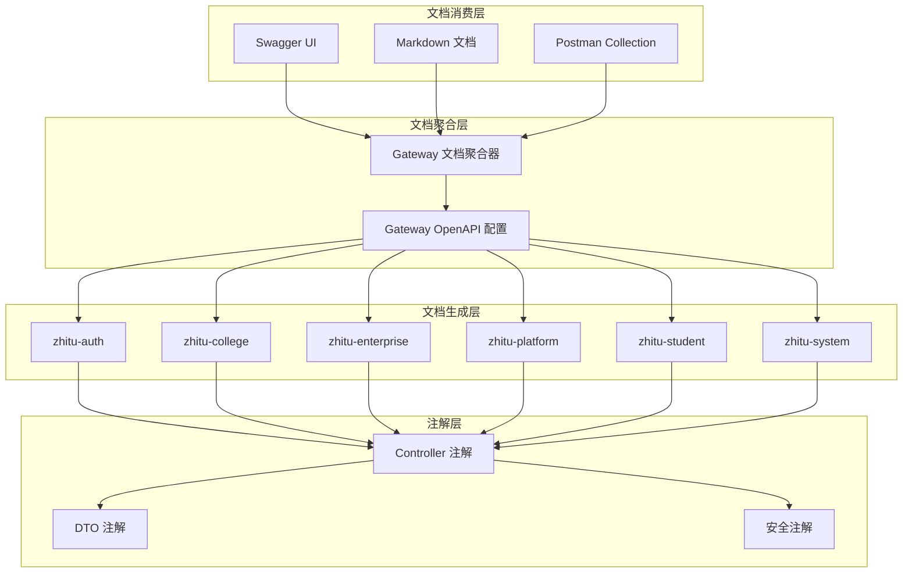

# API 文档与 Swagger 集成 - 设计文档

## Overview

本设计文档描述了智途云平台 API 文档系统的技术实现方案。该系统旨在解决前后端接口不一致的问题，通过标准化的 API 文档生成和优化的 Swagger 集成，确保接口规范的一致性和可维护性。

系统的核心目标包括：
- 为 7 个微服务模块生成模块化的 API 文档
- 优化 SpringDoc OpenAPI 配置以提供交互式文档界面
- 在 Gateway 层聚合所有微服务的 API 文档
- 提供自动化的文档生成和变更追踪机制
- 支持环境级别的访问控制和国际化

技术栈：
- SpringDoc OpenAPI 2.5.0（OpenAPI 3.0 规范）
- Spring Boot 3.2.5
- Spring Cloud Gateway（文档聚合）
- Maven（构建和文档生成）
- Markdown（文档格式）

## Architecture

### 系统架构

API 文档系统采用分层架构，包含以下核心组件：



### 架构决策

1. **分层设计**: 采用四层架构（注解层、生成层、聚合层、消费层），确保关注点分离和可维护性
2. **Gateway 聚合**: 在 Gateway 层统一聚合所有微服务文档，提供单一访问入口
3. **SpringDoc OpenAPI**: 选择 SpringDoc 而非 Springfox，因为它对 Spring Boot 3 和 OpenAPI 3.0 有更好的支持
4. **服务发现集成**: 利用 Nacos 服务发现机制动态获取微服务列表和文档端点
5. **环境隔离**: 通过 Spring Profiles 实现不同环境的文档访问控制

## Components and Interfaces

### 1. 公共 OpenAPI 配置模块

**位置**: `zhitu-common/zhitu-common-core/src/main/java/com/zhitu/common/config/OpenApiConfig.java`

**职责**:
- 提供统一的 OpenAPI 配置
- 配置 JWT Bearer 认证方案
- 定义通用的 API 信息（标题、版本、描述）
- 支持国际化消息

**接口**:
```java
@Configuration
public class OpenApiConfig {
    @Bean
    public OpenAPI customOpenAPI(
        @Value("${spring.application.name}") String serviceName,
        @Value("${springdoc.version:1.0.0}") String version
    );
    
    @Bean
    public GroupedOpenApi publicApi();
    
    private SecurityScheme jwtSecurityScheme();
}
```

### 2. Gateway 文档聚合器

**位置**: `zhitu-gateway/src/main/java/com/zhitu/gateway/config/SwaggerAggregationConfig.java`

**职责**:
- 聚合所有微服务的 OpenAPI 文档
- 从 Nacos 服务注册中心发现微服务
- 为每个服务创建文档分组
- 处理服务不可用的情况

**接口**:
```java
@Configuration
public class SwaggerAggregationConfig {
    @Bean
    public List<GroupedOpenApi> apis(
        DiscoveryClient discoveryClient,
        SwaggerProperties swaggerProperties
    );
    
    private GroupedOpenApi createServiceGroup(
        String serviceName,
        String serviceUrl
    );
}
```

### 3. 文档生成 Maven 插件配置

**位置**: 各微服务的 `pom.xml`

**职责**:
- 在构建时生成 OpenAPI 规范文件
- 验证 Controller 注解完整性
- 生成 Markdown 格式文档
- 生成变更对比报告

**配置**:
```xml
<plugin>
    <groupId>org.springdoc</groupId>
    <artifactId>springdoc-openapi-maven-plugin</artifactId>
    <version>1.4</version>
    <executions>
        <execution>
            <goals>
                <goal>generate</goal>
            </goals>
        </execution>
    </executions>
    <configuration>
        <apiDocsUrl>http://localhost:${server.port}/v3/api-docs</apiDocsUrl>
        <outputFileName>openapi.json</outputFileName>
        <outputDir>${project.basedir}/../../docs/api/${project.artifactId}</outputDir>
    </configuration>
</plugin>
```

### 4. 访问控制过滤器

**位置**: `zhitu-gateway/src/main/java/com/zhitu/gateway/filter/SwaggerAccessFilter.java`

**职责**:
- 控制 Swagger UI 的访问权限
- 验证用户身份和角色
- 记录访问审计日志
- 根据环境配置启用/禁用文档访问

**接口**:
```java
@Component
public class SwaggerAccessFilter implements GlobalFilter, Ordered {
    @Override
    public Mono<Void> filter(
        ServerWebExchange exchange,
        GatewayFilterChain chain
    );
    
    private boolean isSwaggerPath(String path);
    
    private boolean isAuthorized(ServerHttpRequest request);
}
```

### 5. 国际化消息管理器

**位置**: `zhitu-common/zhitu-common-core/src/main/java/com/zhitu/common/i18n/ApiMessageSource.java`

**职责**:
- 管理 API 文档的多语言消息
- 提供消息键到翻译文本的映射
- 支持中文和英文
- 提供回退机制

**接口**:
```java
@Component
public class ApiMessageSource {
    public String getMessage(String key, Locale locale);
    
    public String getMessage(String key, Object[] args, Locale locale);
    
    private String getFallbackMessage(String key);
}
```

### 6. 变更检测器

**位置**: `zhitu-common/zhitu-common-core/src/main/java/com/zhitu/common/doc/ChangeDetector.java`

**职责**:
- 比较两个版本的 OpenAPI 规范
- 识别新增、删除和修改的端点
- 识别参数和响应的变更
- 生成变更报告

**接口**:
```java
@Component
public class ChangeDetector {
    public ChangeReport detectChanges(
        OpenAPI oldSpec,
        OpenAPI newSpec
    );
    
    private List<EndpointChange> compareEndpoints(
        Paths oldPaths,
        Paths newPaths
    );
    
    private List<SchemaChange> compareSchemas(
        Components oldComponents,
        Components newComponents
    );
}
```

## Data Models

### OpenAPI 配置属性

```java
@ConfigurationProperties(prefix = "springdoc")
@Data
public class SpringDocProperties {
    private boolean enabled = true;
    private String version = "1.0.0";
    private ApiInfo apiInfo;
    private Security security;
    private List<String> packagesToScan;
    
    @Data
    public static class ApiInfo {
        private String title;
        private String description;
        private String version;
        private Contact contact;
        private License license;
    }
    
    @Data
    public static class Security {
        private boolean enabled = true;
        private String scheme = "bearer";
        private String bearerFormat = "JWT";
    }
}
```

### Swagger 聚合配置属性

```java
@ConfigurationProperties(prefix = "swagger")
@Data
public class SwaggerProperties {
    private boolean enabled = true;
    private boolean aggregationEnabled = true;
    private List<ServiceDoc> services;
    private AccessControl accessControl;
    
    @Data
    public static class ServiceDoc {
        private String name;
        private String url;
        private String version;
        private boolean enabled = true;
    }
    
    @Data
    public static class AccessControl {
        private boolean enabled = false;
        private List<String> allowedRoles;
        private boolean auditEnabled = true;
    }
}
```

### 变更报告模型

```java
@Data
public class ChangeReport {
    private String timestamp;
    private String oldVersion;
    private String newVersion;
    private List<EndpointChange> endpointChanges;
    private List<SchemaChange> schemaChanges;
    private ChangeStatistics statistics;
    
    @Data
    public static class EndpointChange {
        private ChangeType type; // ADDED, REMOVED, MODIFIED
        private String path;
        private String method;
        private String description;
        private List<ParameterChange> parameterChanges;
        private ResponseChange responseChange;
    }
    
    @Data
    public static class SchemaChange {
        private ChangeType type;
        private String schemaName;
        private List<PropertyChange> propertyChanges;
    }
    
    @Data
    public static class ChangeStatistics {
        private int addedEndpoints;
        private int removedEndpoints;
        private int modifiedEndpoints;
        private int addedSchemas;
        private int removedSchemas;
        private int modifiedSchemas;
    }
}
```

### 文档元数据模型

```java
@Data
public class DocumentMetadata {
    private String serviceName;
    private String version;
    private String generatedAt;
    private String generatedBy;
    private String environment;
    private Map<String, String> customProperties;
}
```

## Correctness Properties

*A property is a characteristic or behavior that should hold true across all valid executions of a system-essentially, a formal statement about what the system should do. Properties serve as the bridge between human-readable specifications and machine-verifiable correctness guarantees.*

### Property 1: 文档生成完整性

*For any* 微服务列表，当执行文档生成时，系统应为每个服务生成独立的 API 文档文件，且文档应包含所有必需的元素（HTTP 方法、路径、参数、响应、数据模型、认证要求）。

**Validates: Requirements 1.1, 1.3, 1.4, 1.5**

### Property 2: 文档目录结构一致性

*For any* 生成的文档集合，所有文档应按照微服务模块划分到 `docs/api/{module-name}` 目录结构中，且每个模块目录应包含 README 文件。

**Validates: Requirements 1.2, 1.6, 1.7**

### Property 3: 文档格式标准化

*For any* 生成的 API 规范文档，文档应使用 Markdown 格式，包含接口概述、请求/响应示例、参数标注（必填/可选）、错误码列表、版本信息和变更历史。

**Validates: Requirements 2.1, 2.2, 2.3, 2.4, 2.5, 2.6**

### Property 4: Controller 文档覆盖率

*For any* Controller 类中的公共方法，API 规范文档应包含对应的文档条目。

**Validates: Requirements 2.7**

### Property 5: 依赖配置一致性

*For any* 后端微服务模块，其 pom.xml 应包含 springdoc-openapi-starter-webmvc-ui 依赖。

**Validates: Requirements 3.1**

### Property 6: Swagger UI 可访问性

*For any* 启用了 Swagger 的微服务，访问其 Swagger UI 端点应返回成功响应，且显示该服务的所有 API 端点。

**Validates: Requirements 3.4, 3.5**

### Property 7: Gateway 文档聚合完整性

*For any* 在 Nacos 注册的微服务列表，Gateway 的聚合文档应为每个服务创建独立的文档分组，且保留各服务的原始路径前缀。

**Validates: Requirements 3.7, 5.2, 5.4, 5.5**

### Property 8: 注解完整性

*For any* Controller 类，应有 @Tag 注解；*for any* Controller 方法，应有 @Operation 注解；*for any* 请求参数，应有 @Parameter 注解；*for any* DTO 类字段，应有 @Schema 注解。

**Validates: Requirements 4.1, 4.2, 4.3, 4.4, 4.5**

### Property 9: 错误响应文档化

*For any* 可能返回错误的 Controller 方法，应使用 @ApiResponse 注解描述错误场景，且注解应包含示例值。

**Validates: Requirements 4.6, 4.7**

### Property 10: 变更检测准确性

*For any* 两个版本的 OpenAPI 规范，变更检测器应正确识别所有新增、删除和修改的端点、参数和响应格式，并生成包含时间戳的变更报告。

**Validates: Requirements 6.1, 6.2, 6.3, 6.4, 6.5, 6.6**

### Property 11: 环境访问控制

*For any* 环境配置，当 Swagger UI 在生产环境时应默认禁用，在开发和测试环境时应默认启用；当启用时，未授权访问应返回 403 状态码，且所有访问应记录审计日志。

**Validates: Requirements 7.1, 7.2, 7.3, 7.4, 7.6, 7.7**

### Property 12: 构建时文档生成

*For any* 微服务构建过程，Maven 插件应自动生成 OpenAPI JSON/YAML 规范文件到 `docs/api/openapi` 目录，验证注解完整性，并在发现缺少注解时输出警告。

**Validates: Requirements 8.2, 8.3, 8.4, 8.5**

### Property 13: 测试数据完整性

*For any* API 端点，文档应包含至少一个有效的请求示例、一个成功的响应示例、常见错误场景示例、边界值测试用例和前置条件说明，且 Swagger UI 应预填充这些示例数据。

**Validates: Requirements 9.1, 9.2, 9.3, 9.4, 9.5, 9.6**

### Property 14: 国际化支持

*For any* API 文档，系统应支持生成中文和英文两种语言版本，文档应按语言代码组织，所有接口描述和错误消息应提供双语版本，注解应使用 i18n 消息键，且缺少翻译时应回退到中文。

**Validates: Requirements 10.1, 10.2, 10.3, 10.4, 10.5, 10.6, 10.7**

## Error Handling

### 1. 服务不可用错误

**场景**: Gateway 聚合文档时，某个微服务不可用

**处理策略**:
- 捕获连接异常，记录警告日志
- 在聚合文档界面显示服务不可用提示
- 继续加载其他可用服务的文档
- 提供重试机制

**实现**:
```java
try {
    OpenAPI serviceDoc = fetchServiceDoc(serviceUrl);
    groups.add(createServiceGroup(serviceName, serviceDoc));
} catch (ServiceUnavailableException e) {
    log.warn("Service {} is unavailable: {}", serviceName, e.getMessage());
    groups.add(createUnavailableServiceGroup(serviceName));
}
```

### 2. 注解缺失错误

**场景**: Controller 方法缺少必要的 Swagger 注解

**处理策略**:
- 在构建时扫描所有 Controller
- 输出警告信息，列出缺少注解的方法
- 不中断构建过程
- 生成注解缺失报告

**实现**:
```java
List<AnnotationViolation> violations = annotationValidator.validate(controllers);
if (!violations.isEmpty()) {
    log.warn("Found {} annotation violations:", violations.size());
    violations.forEach(v -> log.warn("  - {}", v.getMessage()));
    reportGenerator.generateViolationReport(violations);
}
```

### 3. 文档生成失败

**场景**: Maven 插件执行文档生成时失败

**处理策略**:
- 捕获生成异常，记录详细错误信息
- 检查服务是否启动
- 验证配置是否正确
- 提供诊断建议

**实现**:
```java
try {
    generateDocumentation();
} catch (DocumentGenerationException e) {
    log.error("Failed to generate documentation: {}", e.getMessage());
    log.error("Possible causes:");
    log.error("  1. Service is not running");
    log.error("  2. API docs endpoint is not accessible");
    log.error("  3. OpenAPI configuration is incorrect");
    throw new MojoExecutionException("Documentation generation failed", e);
}
```

### 4. 访问权限错误

**场景**: 用户尝试访问 Swagger UI 但没有权限

**处理策略**:
- 验证 JWT token
- 检查用户角色
- 返回 403 Forbidden 响应
- 记录未授权访问尝试

**实现**:
```java
if (!accessControl.isEnabled()) {
    return chain.filter(exchange);
}

String token = extractToken(request);
if (token == null || !jwtValidator.validate(token)) {
    auditLogger.logUnauthorizedAccess(request);
    return unauthorized(exchange);
}

List<String> roles = jwtValidator.extractRoles(token);
if (!accessControl.hasRequiredRole(roles)) {
    auditLogger.logForbiddenAccess(request, roles);
    return forbidden(exchange);
}
```

### 5. 国际化回退

**场景**: 请求的语言翻译不存在

**处理策略**:
- 尝试加载请求的语言资源
- 如果不存在，回退到默认语言（中文）
- 记录缺失的翻译键
- 继续正常处理请求

**实现**:
```java
public String getMessage(String key, Locale locale) {
    try {
        return messageSource.getMessage(key, null, locale);
    } catch (NoSuchMessageException e) {
        log.debug("Translation not found for key '{}' in locale '{}', falling back to default", 
                  key, locale);
        return messageSource.getMessage(key, null, Locale.CHINESE);
    }
}
```

## Testing Strategy

### 单元测试

单元测试专注于验证特定示例、边界情况和错误条件：

1. **OpenAPI 配置测试**
   - 验证 JWT Bearer 安全方案配置正确
   - 验证 API 信息（标题、版本、描述）设置正确
   - 测试不同环境配置的加载

2. **文档聚合测试**
   - 测试单个服务的文档分组创建
   - 测试服务不可用时的错误处理
   - 测试路径前缀保留逻辑

3. **访问控制测试**
   - 测试有效 token 的访问授权
   - 测试无效 token 的访问拒绝
   - 测试角色权限验证
   - 测试审计日志记录

4. **变更检测测试**
   - 测试新增端点的识别
   - 测试删除端点的识别
   - 测试参数变更的识别
   - 测试响应格式变更的识别

5. **国际化测试**
   - 测试中文消息加载
   - 测试英文消息加载
   - 测试回退机制
   - 测试消息键解析

### 属性测试

属性测试使用 jqwik 库验证通用属性，每个测试运行最少 100 次迭代：

1. **文档生成完整性测试**
   ```java
   @Property(tries = 100)
   // Feature: api-documentation-and-swagger-integration, Property 1: 文档生成完整性
   void generatedDocumentationShouldContainAllRequiredElements(
       @ForAll List<@From("serviceNames") String> services
   ) {
       // 为每个服务生成文档
       // 验证每个文档包含所有必需元素
   }
   ```

2. **目录结构一致性测试**
   ```java
   @Property(tries = 100)
   // Feature: api-documentation-and-swagger-integration, Property 2: 文档目录结构一致性
   void documentsShouldBeOrganizedByModule(
       @ForAll List<@From("serviceNames") String> services
   ) {
       // 生成文档
       // 验证目录结构符合 docs/api/{module-name} 模式
       // 验证每个目录包含 README
   }
   ```

3. **Controller 覆盖率测试**
   ```java
   @Property(tries = 100)
   // Feature: api-documentation-and-swagger-integration, Property 4: Controller 文档覆盖率
   void allControllerMethodsShouldBeDocumented(
       @ForAll @From("controllers") Class<?> controllerClass
   ) {
       // 扫描 Controller 的所有公共方法
       // 验证每个方法在文档中有对应条目
   }
   ```

4. **注解完整性测试**
   ```java
   @Property(tries = 100)
   // Feature: api-documentation-and-swagger-integration, Property 8: 注解完整性
   void controllersShouldHaveCompleteAnnotations(
       @ForAll @From("controllers") Class<?> controllerClass
   ) {
       // 验证类有 @Tag 注解
       // 验证方法有 @Operation 注解
       // 验证参数有 @Parameter 注解
       // 验证 DTO 字段有 @Schema 注解
   }
   ```

5. **变更检测准确性测试**
   ```java
   @Property(tries = 100)
   // Feature: api-documentation-and-swagger-integration, Property 10: 变更检测准确性
   void changeDetectorShouldIdentifyAllChanges(
       @ForAll @From("openApiSpecs") OpenAPI oldSpec,
       @ForAll @From("openApiSpecs") OpenAPI newSpec
   ) {
       // 执行变更检测
       // 验证所有新增、删除、修改的端点被识别
       // 验证报告包含时间戳
   }
   ```

6. **国际化支持测试**
   ```java
   @Property(tries = 100)
   // Feature: api-documentation-and-swagger-integration, Property 14: 国际化支持
   void documentationShouldSupportMultipleLanguages(
       @ForAll @From("messageKeys") String messageKey,
       @ForAll @From("locales") Locale locale
   ) {
       // 获取消息
       // 验证中文和英文版本存在
       // 验证回退机制
   }
   ```

### 集成测试

集成测试验证组件之间的交互：

1. **Gateway 聚合集成测试**
   - 启动多个微服务实例
   - 验证 Gateway 能发现并聚合所有服务文档
   - 验证聚合后的 Swagger UI 可访问
   - 验证可以通过 Gateway 测试各服务 API

2. **文档生成流程测试**
   - 执行完整的 Maven 构建
   - 验证文档文件生成到正确位置
   - 验证 OpenAPI 规范文件格式正确
   - 验证变更报告生成

3. **访问控制集成测试**
   - 配置不同环境（dev、test、prod）
   - 验证访问控制规则在各环境正确应用
   - 验证审计日志正确记录

### 测试配置

**jqwik 配置** (`src/test/resources/jqwik.properties`):
```properties
jqwik.tries.default = 100
jqwik.reporting.onlyFailures = false
jqwik.shrinking.bounded = 1000
```

**测试依赖** (pom.xml):
```xml
<dependency>
    <groupId>net.jqwik</groupId>
    <artifactId>jqwik</artifactId>
    <version>1.8.2</version>
    <scope>test</scope>
</dependency>
<dependency>
    <groupId>org.springframework.boot</groupId>
    <artifactId>spring-boot-starter-test</artifactId>
    <scope>test</scope>
</dependency>
```
