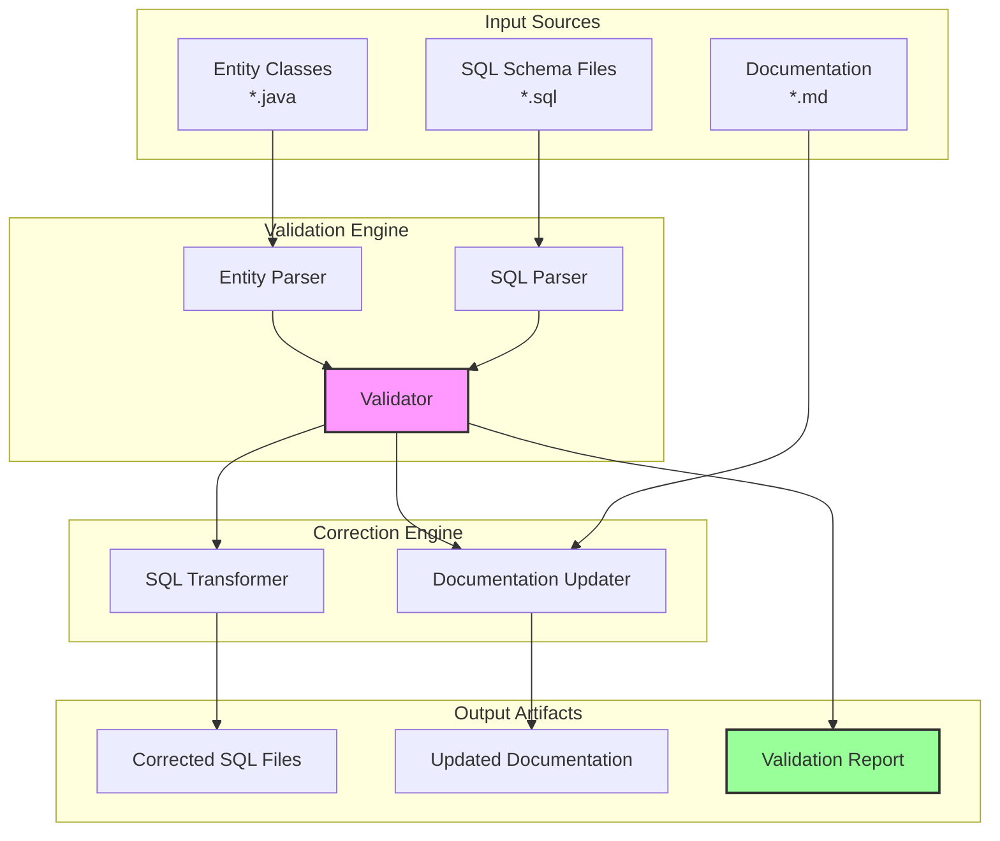

# Design Document: Database Schema Completion

## Overview

This design document provides the technical approach for completing and fixing the database schema for the Zhitu (智图) Internship Management Platform. The system uses PostgreSQL 15+ with schema-based isolation for microservices, where each service has its own PostgreSQL schema. The implementation will address 12 critical requirements including schema naming inconsistencies, SQL syntax errors, missing fields, and documentation updates.

### Problem Statement

The current database schema has several critical issues that prevent proper system operation:

1. **Schema Naming Mismatch**: The `growth_service` schema in SQL files conflicts with `growth_svc` used in entity `@TableName` annotations
2. **Invalid SQL Syntax**: Inline `COMMENT` keywords in CREATE TABLE statements are invalid PostgreSQL syntax
3. **Database Name Inconsistency**: Documentation references `zhitu_db` while the actual database is `zhitu_cloud`
4. **Potential Field Mapping Issues**: Entity fields may not have corresponding SQL columns
5. **Missing or Incomplete Constraints**: Foreign keys, indexes, and check constraints may be incomplete

### Solution Approach

The solution implements a validation-and-correction workflow that:

1. Scans all entity classes to extract schema names, field mappings, and relationships
2. Parses all SQL schema files to extract table definitions, columns, and constraints
3. Compares entities against SQL definitions to identify mismatches
4. Generates corrected SQL files with standardized naming and valid syntax
5. Updates all documentation to reflect the corrected schema
6. Produces a comprehensive validation report

### Key Design Decisions

**Decision 1: Schema Naming Standardization**
- **Choice**: Standardize on `growth_svc` (matching entity annotations)
- **Rationale**: Entity annotations are the source of truth for MyBatis-Plus ORM. Changing SQL files is safer than changing Java code that may already be deployed
- **Impact**: Rename `growth_service` to `growth_svc` in SQL file 08_growth_service.sql

**Decision 2: SQL Syntax Correction Strategy**
- **Choice**: Remove all inline COMMENT keywords and convert to COMMENT ON statements
- **Rationale**: PostgreSQL does not support inline COMMENT syntax. The COMMENT ON syntax is the standard approach
- **Impact**: All 8 schema files need syntax transformation

**Decision 3: Database Name**
- **Choice**: Use `zhitu_cloud` as the canonical database name
- **Rationale**: Backend configuration files already use `zhitu_cloud`, indicating this is the production standard
- **Impact**: Update database/README.md, database/init_database.sql, and database/MIGRATION_GUIDE.md

**Decision 4: Validation Approach**
- **Choice**: Implement automated validation script rather than manual review
- **Rationale**: Ensures consistency, repeatability, and catches all issues across 8 schema files and 25+ entity classes
- **Impact**: Create validation tooling as part of the implementation

## Architecture

### System Components



### Workflow Phases

**Phase 1: Discovery and Analysis**
1. Scan `backend/` directory for all `@TableName` annotations
2. Extract schema names, table names, and field definitions from entities
3. Parse all SQL files in `database/schema/` directory
4. Extract schema names, table names, column definitions, constraints, and indexes
5. Build in-memory models of both entity and SQL structures

**Phase 2: Validation**
1. Compare schema names between entities and SQL files
2. Validate SQL syntax (check for inline COMMENT keywords)
3. Verify field-to-column mappings (camelCase to snake_case)
4. Check foreign key constraints against entity relationships
5. Validate index coverage on foreign keys and frequently queried columns
6. Verify soft delete implementation (is_deleted column and @TableLogic)
7. Check timestamp columns (created_at, updated_at with TIMESTAMPTZ)
8. Validate check constraints against entity enum values
9. Scan documentation for database name references

**Phase 3: Correction**
1. Generate corrected SQL files with:
   - Fixed schema names
   - Valid COMMENT ON syntax
   - Missing columns added
   - Missing foreign keys added
   - Missing indexes added
2. Update documentation files with correct database name
3. Update ER diagram if relationships changed

**Phase 4: Reporting**
1. Generate comprehensive validation report
2. Categorize issues by severity (critical, warning, info)
3. Document all corrections with before/after examples
4. Provide summary statistics by schema

## Components and Interfaces

### Entity Parser

**Purpose**: Extract schema and field information from Java entity classes

**Input**: Java source files with MyBatis-Plus annotations

**Output**: Entity metadata structure

```typescript
interface EntityMetadata {
  className: string;
  schemaName: string;
  tableName: string;
  fields: FieldMetadata[];
  extendsBaseEntity: boolean;
}

interface FieldMetadata {
  javaName: string;        // camelCase
  sqlName: string;         // snake_case (derived)
  javaType: string;        // Long, String, LocalDateTime, etc.
  annotations: string[];   // @TableId, @TableLogic, @TableField
}
```

**Key Operations**:
- Parse `@TableName(schema = "...", value = "...")` annotations
- Extract field declarations and their types
- Identify fields inherited from BaseEntity
- Convert camelCase field names to snake_case column names

**Naming Convention Rules**:
```
userId → user_id
createdAt → created_at
isDeleted → is_deleted
tenantId → tenant_id
```

### SQL Parser

**Purpose**: Extract table and column information from SQL schema files

**Input**: SQL CREATE TABLE statements

**Output**: SQL metadata structure

```typescript
interface SQLMetadata {
  schemaName: string;
  tables: TableMetadata[];
}

interface TableMetadata {
  tableName: string;
  columns: ColumnMetadata[];
  constraints: ConstraintMetadata[];
  indexes: IndexMetadata[];
  comments: CommentMetadata[];
}

interface ColumnMetadata {
  columnName: string;
  dataType: string;
  nullable: boolean;
  defaultValue?: string;
  hasInlineComment: boolean;  // Flag for syntax error
}

interface ConstraintMetadata {
  type: 'PRIMARY KEY' | 'FOREIGN KEY' | 'UNIQUE' | 'CHECK';
  name?: string;
  columns: string[];
  referencedTable?: string;
  referencedColumns?: string[];
}

interface IndexMetadata {
  name: string;
  columns: string[];
  unique: boolean;
  whereClause?: string;
}

interface CommentMetadata {
  target: 'TABLE' | 'COLUMN';
  targetName: string;
  comment: string;
}
```

**Key Operations**:
- Parse CREATE SCHEMA statements
- Parse CREATE TABLE statements
- Extract column definitions with data types
- Identify inline COMMENT keywords (syntax errors)
- Parse CONSTRAINT definitions
- Parse CREATE INDEX statements
- Parse COMMENT ON statements

### Validator

**Purpose**: Compare entity metadata against SQL metadata to identify issues

**Input**: EntityMetadata[] and SQLMetadata[]

**Output**: ValidationIssue[]

```typescript
interface ValidationIssue {
  severity: 'critical' | 'warning' | 'info';
  category: string;
  entity?: string;
  sqlFile?: string;
  description: string;
  recommendation: string;
}
```

**Validation Rules**:

1. **Schema Name Consistency**
   - For each entity, verify schema name matches SQL file schema name
   - Severity: critical
   - Example: `growth_svc` in entity vs `growth_service` in SQL

2. **SQL Syntax Validation**
   - Check for inline COMMENT keywords in column definitions
   - Severity: critical
   - Pattern: `COMMENT '...'` within CREATE TABLE

3. **Field-to-Column Mapping**
   - For each entity field, verify corresponding SQL column exists
   - Apply camelCase to snake_case conversion
   - Severity: critical if missing
   - Special handling for BaseEntity fields (id, created_at, updated_at, is_deleted)

4. **Foreign Key Validation**
   - For each field ending in "Id", check if foreign key constraint exists
   - Determine referenced table from field name
   - Severity: warning (data integrity concern)

5. **Index Coverage**
   - Verify indexes exist on:
     - All foreign key columns
     - tenant_id columns
     - status/type enum columns
   - Verify partial indexes use `WHERE is_deleted = FALSE`
   - Severity: warning (performance concern)

6. **Soft Delete Implementation**
   - Verify `is_deleted BOOLEAN NOT NULL DEFAULT FALSE` column exists
   - Verify entity has `@TableLogic` annotation
   - Severity: critical

7. **Timestamp Columns**
   - Verify `created_at TIMESTAMPTZ NOT NULL DEFAULT CURRENT_TIMESTAMP`
   - Verify `updated_at TIMESTAMPTZ NOT NULL DEFAULT CURRENT_TIMESTAMP`
   - Verify entity has corresponding LocalDateTime fields
   - Severity: critical

8. **Check Constraints**
   - For status/type integer fields, verify CHECK constraint exists
   - Compare constraint values with entity comments
   - Severity: warning (data validation concern)

### SQL Transformer

**Purpose**: Generate corrected SQL files based on validation issues

**Input**: SQLMetadata and ValidationIssue[]

**Output**: Corrected SQL file content

**Transformation Rules**:

1. **Schema Name Correction**
```sql
-- Before
CREATE SCHEMA IF NOT EXISTS growth_service;
CREATE TABLE growth_service.warning_record (

-- After
CREATE SCHEMA IF NOT EXISTS growth_svc;
CREATE TABLE growth_svc.warning_record (
```

2. **COMMENT Syntax Correction**
```sql
-- Before
CREATE TABLE auth_center.sys_tenant (
    id BIGSERIAL PRIMARY KEY,
    name VARCHAR(100) NOT NULL COMMENT '机构名称',
    type SMALLINT NOT NULL COMMENT '类型: 0=平台 1=高校 2=企业'
);

-- After
CREATE TABLE auth_center.sys_tenant (
    id BIGSERIAL PRIMARY KEY,
    name VARCHAR(100) NOT NULL,
    type SMALLINT NOT NULL
);

COMMENT ON TABLE auth_center.sys_tenant IS '租户/机构表';
COMMENT ON COLUMN auth_center.sys_tenant.name IS '机构名称';
COMMENT ON COLUMN auth_center.sys_tenant.type IS '类型: 0=平台 1=高校 2=企业';
```

3. **Missing Column Addition**
```sql
-- If entity has field but SQL table doesn't
ALTER TABLE schema_name.table_name 
ADD COLUMN column_name data_type constraints;
```

4. **Missing Foreign Key Addition**
```sql
-- If entity has userId field but no FK constraint
ALTER TABLE schema_name.table_name
ADD CONSTRAINT fk_table_user 
FOREIGN KEY (user_id) REFERENCES auth_center.sys_user(id);
```

5. **Missing Index Addition**
```sql
-- If foreign key column lacks index
CREATE INDEX idx_table_column 
ON schema_name.table_name(column_name) 
WHERE is_deleted = FALSE;
```

### Documentation Updater

**Purpose**: Update documentation files with correct database name and schema information

**Input**: Documentation files and correction metadata

**Output**: Updated documentation files

**Update Rules**:

1. **Database Name Replacement**
   - Replace all occurrences of `zhitu_db` with `zhitu_cloud`
   - Files: database/README.md, database/init_database.sql, database/MIGRATION_GUIDE.md

2. **Schema Name Updates**
   - Update schema references from `growth_service` to `growth_svc`
   - Files: database/README.md, database/init_database.sql, database/ER_DIAGRAM.md

3. **ER Diagram Synchronization**
   - Update table names if changed
   - Update foreign key relationships if added
   - Update column lists if columns added

## Data Models

### BaseEntity Pattern

All entities extend BaseEntity which provides common fields:

```java
public abstract class BaseEntity implements Serializable {
    @TableId(type = IdType.AUTO)
    private Long id;

    @TableField(fill = FieldFill.INSERT)
    private LocalDateTime createdAt;

    @TableField(fill = FieldFill.INSERT_UPDATE)
    private LocalDateTime updatedAt;

    @TableLogic(value = "false", delval = "true")
    @TableField("is_deleted")
    private Boolean deleted;
}
```

Corresponding SQL pattern:

```sql
CREATE TABLE schema_name.table_name (
    id BIGSERIAL PRIMARY KEY,
    -- ... other columns ...
    created_at TIMESTAMPTZ NOT NULL DEFAULT CURRENT_TIMESTAMP,
    updated_at TIMESTAMPTZ NOT NULL DEFAULT CURRENT_TIMESTAMP,
    is_deleted BOOLEAN NOT NULL DEFAULT FALSE
);
```

### Schema-to-Entity Mapping

| Schema | Entity Module | Entity Count | Key Tables |
|--------|---------------|--------------|------------|
| auth_center | zhitu-auth, zhitu-system | 3 | sys_tenant, sys_user, sys_refresh_token |
| platform_service | zhitu-system | 1 | sys_dict |
| student_svc | zhitu-college, zhitu-student | 1 | student_info |
| college_svc | zhitu-college | 2 | college_info, organization |
| enterprise_svc | zhitu-enterprise, zhitu-platform | 3 | enterprise_info, enterprise_staff, talent_pool |
| internship_svc | zhitu-enterprise | 7 | internship_job, job_application, internship_offer, internship_record, weekly_report, attendance, internship_certificate |
| training_svc | zhitu-college, zhitu-platform | 2 | training_project, training_plan |
| growth_svc | zhitu-college, zhitu-student | 3 | evaluation_record, growth_badge, warning_record |

### Type Mapping Rules

| Java Type | PostgreSQL Type | Notes |
|-----------|-----------------|-------|
| Long | BIGINT | For IDs and foreign keys |
| String | VARCHAR(n) or TEXT | VARCHAR for bounded, TEXT for unbounded |
| Integer | INTEGER or SMALLINT | SMALLINT for enums/status |
| Boolean | BOOLEAN | For flags like is_deleted, is_mentor |
| LocalDateTime | TIMESTAMPTZ | Always use TIMESTAMPTZ for timezone awareness |
| LocalDate | DATE | For dates without time |
| BigDecimal | DECIMAL(p,s) | For precise numeric values |

### Constraint Patterns

**Foreign Key Naming Convention**:
```
fk_{table}_{referenced_table}
Example: fk_student_user, fk_warning_tenant
```

**Index Naming Convention**:
```
idx_{table}_{column}
Example: idx_student_tenant, idx_warning_status
```

**Check Constraint Naming Convention**:
```
chk_{table}_{column}
Example: chk_tenant_type, chk_warning_level
```

## File-by-File Correction Plan

### 01_auth_center.sql
**Issues**: Inline COMMENT syntax
**Corrections**:
- Remove inline COMMENT keywords from all column definitions
- Add COMMENT ON TABLE and COMMENT ON COLUMN statements after each table
- No schema name changes needed (auth_center is correct)

### 02_platform_service.sql
**Issues**: Inline COMMENT syntax
**Corrections**:
- Remove inline COMMENT keywords
- Add COMMENT ON statements
- No schema name changes needed

### 03_student_svc.sql
**Issues**: Inline COMMENT syntax
**Corrections**:
- Remove inline COMMENT keywords
- Add COMMENT ON statements
- No schema name changes needed

### 04_college_svc.sql
**Issues**: Inline COMMENT syntax
**Corrections**:
- Remove inline COMMENT keywords
- Add COMMENT ON statements
- No schema name changes needed

### 05_enterprise_svc.sql
**Issues**: Inline COMMENT syntax
**Corrections**:
- Remove inline COMMENT keywords
- Add COMMENT ON statements
- No schema name changes needed

### 06_internship_svc.sql
**Issues**: Inline COMMENT syntax
**Corrections**:
- Remove inline COMMENT keywords
- Add COMMENT ON statements
- No schema name changes needed

### 07_training_svc.sql
**Issues**: Inline COMMENT syntax
**Corrections**:
- Remove inline COMMENT keywords
- Add COMMENT ON statements
- No schema name changes needed

### 08_growth_service.sql
**Issues**: Schema name mismatch, inline COMMENT syntax
**Corrections**:
- Rename schema from `growth_service` to `growth_svc`
- Remove inline COMMENT keywords
- Add COMMENT ON statements
- Update all table references to use `growth_svc` schema

### init_database.sql
**Issues**: Database name references, schema name references
**Corrections**:
- Replace `zhitu_db` with `zhitu_cloud`
- Replace `growth_service` with `growth_svc` in schema lists
- Update GRANT statements to include `growth_svc`

### README.md
**Issues**: Database name references, schema name references
**Corrections**:
- Replace all `zhitu_db` with `zhitu_cloud`
- Replace `growth_service` with `growth_svc` in schema tables
- Update example commands to use `zhitu_cloud`

### MIGRATION_GUIDE.md
**Issues**: Database name references
**Corrections**:
- Replace all `zhitu_db` with `zhitu_cloud`
- Update migration examples

### ER_DIAGRAM.md
**Issues**: Schema name references
**Corrections**:
- Replace `growth_service` with `growth_svc` in diagrams
- Verify all table names match SQL files
- Verify all foreign key relationships are documented


## Correctness Properties

*A property is a characteristic or behavior that should hold true across all valid executions of a system—essentially, a formal statement about what the system should do. Properties serve as the bridge between human-readable specifications and machine-verifiable correctness guarantees.*

### Property 1: Schema Name Mismatch Detection

*For any* entity class with a @TableName annotation, the system should correctly identify whether the schema name in the annotation matches the schema name in the corresponding SQL file.

**Validates: Requirements 1.2**

### Property 2: Schema Name Correction

*For any* detected schema name mismatch between an entity and SQL file, the SQL file should be updated to match the entity's @TableName schema parameter.

**Validates: Requirements 1.3**

### Property 3: Comment Syntax Transformation Preserves Content

*For any* SQL CREATE TABLE statement with inline COMMENT keywords, transforming to COMMENT ON syntax should preserve all comment text exactly.

**Validates: Requirements 2.4**

### Property 4: Comment Syntax Elimination

*For any* SQL file after processing, no inline COMMENT keywords should remain in CREATE TABLE statements.

**Validates: Requirements 2.1, 2.3**

### Property 5: Comment Conversion Completeness

*For any* column or table with an inline comment, a corresponding COMMENT ON statement should exist after transformation.

**Validates: Requirements 2.2**

### Property 6: Field-to-Column Mapping Detection

*For any* entity field, the system should correctly identify whether a corresponding SQL column exists, applying camelCase to snake_case conversion.

**Validates: Requirements 4.1, 4.2, 4.3, 4.5**

### Property 7: Missing Column Addition

*For any* entity field without a corresponding SQL column, the SQL file should be updated to add the column with appropriate data type and constraints.

**Validates: Requirements 4.4**

### Property 8: Foreign Key Detection

*For any* entity field ending in "Id", the system should correctly identify whether a corresponding foreign key constraint exists in the SQL table.

**Validates: Requirements 5.1**

### Property 9: Foreign Key Reference Inference

*For any* entity field ending in "Id" without a foreign key constraint, the system should correctly infer the referenced table from the field name.

**Validates: Requirements 5.2**

### Property 10: Foreign Key Addition

*For any* missing foreign key constraint where the referenced table exists, the SQL file should be updated to add the appropriate FOREIGN KEY constraint.

**Validates: Requirements 5.3**

### Property 11: Foreign Key Validity

*For any* existing foreign key constraint in SQL, the referenced table and columns should exist and be valid.

**Validates: Requirements 5.4**

### Property 12: Index Coverage on Foreign Keys

*For any* foreign key column in a SQL table, an index should exist on that column.

**Validates: Requirements 6.2**

### Property 13: Index Coverage on Tenant Columns

*For any* table with a tenant_id column, an index should exist on tenant_id with a partial index clause "WHERE is_deleted = FALSE".

**Validates: Requirements 6.1**

### Property 14: Index Coverage on Enum Columns

*For any* table with status or type columns, indexes should exist on those columns.

**Validates: Requirements 6.3**

### Property 15: Partial Index on Soft Delete Tables

*For any* index on a table with an is_deleted column, the index should include "WHERE is_deleted = FALSE" for non-unique indexes.

**Validates: Requirements 6.4**

### Property 16: Soft Delete Column Presence

*For any* SQL table, an "is_deleted BOOLEAN NOT NULL DEFAULT FALSE" column should exist.

**Validates: Requirements 7.1, 7.4**

### Property 17: Soft Delete Entity Annotation

*For any* entity class, an "isDeleted" field with @TableLogic annotation should exist.

**Validates: Requirements 7.2**

### Property 18: Soft Delete Index Consistency

*For any* non-unique index on a table with is_deleted column, the index should include "WHERE is_deleted = FALSE".

**Validates: Requirements 7.3**

### Property 19: Timestamp Column Presence

*For any* SQL table, both "created_at TIMESTAMPTZ NOT NULL DEFAULT CURRENT_TIMESTAMP" and "updated_at TIMESTAMPTZ NOT NULL DEFAULT CURRENT_TIMESTAMP" columns should exist.

**Validates: Requirements 8.1, 8.2**

### Property 20: Timestamp Entity Fields

*For any* entity class, both createdAt and updatedAt fields with appropriate @TableField annotations should exist.

**Validates: Requirements 8.3**

### Property 21: Timestamp Timezone Awareness

*For any* timestamp column in SQL, the data type should be TIMESTAMPTZ (not TIMESTAMP).

**Validates: Requirements 8.4**

### Property 22: Check Constraint Presence

*For any* SQL table with status or type columns, CHECK constraints should exist limiting valid values.

**Validates: Requirements 9.1, 9.2, 9.3**

### Property 23: Check Constraint Value Consistency

*For any* CHECK constraint on an enum column, the constraint values should match the valid values documented in the corresponding entity comments.

**Validates: Requirements 9.4**

### Property 24: Validation Report Completeness

*For any* validation run, the generated report should include all issues found, categorized by severity (critical, warning, info), with summary counts by category and schema.

**Validates: Requirements 10.1, 10.3, 10.4**

### Property 25: Validation Report Fix Documentation

*For any* issue that is fixed, the report should document the fix with before/after examples.

**Validates: Requirements 10.2**

### Property 26: ER Diagram Table Name Consistency

*For any* table in the SQL files, the table name should appear in the ER diagram.

**Validates: Requirements 11.1, 11.3**

### Property 27: ER Diagram Relationship Consistency

*For any* foreign key relationship in SQL, the relationship should be represented in the ER diagram.

**Validates: Requirements 11.2**

### Property 28: ER Diagram Data Type Consistency

*For any* column in the ER diagram, the data type should match the SQL definition.

**Validates: Requirements 11.4**

### Property 29: Entity Schema Annotation Completeness

*For any* entity with @TableName annotation, the schema parameter should be explicitly specified (not default).

**Validates: Requirements 12.2, 12.3**

### Property 30: MyBatis-Plus Configuration Validation

*For any* application.yml file, MyBatis-Plus configuration should include schema handling settings.

**Validates: Requirements 12.1, 12.4**

## Error Handling

### Validation Errors

**Entity Parsing Errors**
- **Cause**: Malformed Java syntax, missing annotations
- **Handling**: Log error with file path and line number, skip entity, continue validation
- **Recovery**: Manual review of entity class required

**SQL Parsing Errors**
- **Cause**: Invalid SQL syntax, unexpected keywords
- **Handling**: Log error with file path and line number, skip table, continue validation
- **Recovery**: Manual review of SQL file required

**Schema Name Mismatch**
- **Cause**: Entity uses different schema name than SQL file
- **Handling**: Log as critical issue, generate correction in SQL file
- **Recovery**: Automatic correction applied

**Missing Column**
- **Cause**: Entity field has no corresponding SQL column
- **Handling**: Log as critical issue, generate ALTER TABLE statement
- **Recovery**: Automatic correction applied

**Missing Foreign Key**
- **Cause**: Entity field ending in "Id" has no FK constraint
- **Handling**: Log as warning, generate ALTER TABLE ADD CONSTRAINT statement
- **Recovery**: Automatic correction applied (if referenced table exists)

**Missing Index**
- **Cause**: Foreign key or frequently queried column lacks index
- **Handling**: Log as warning, generate CREATE INDEX statement
- **Recovery**: Automatic correction applied

**Invalid SQL Syntax (Inline COMMENT)**
- **Cause**: SQL file uses inline COMMENT keywords
- **Handling**: Log as critical issue, transform to COMMENT ON syntax
- **Recovery**: Automatic correction applied

### File Operation Errors

**File Not Found**
- **Cause**: Expected entity or SQL file doesn't exist
- **Handling**: Log error, skip file, continue validation
- **Recovery**: Manual investigation required

**File Read Error**
- **Cause**: Permission denied, file locked, encoding issues
- **Handling**: Log error with details, skip file, continue validation
- **Recovery**: Fix file permissions or encoding

**File Write Error**
- **Cause**: Permission denied, disk full, file locked
- **Handling**: Log error, abort correction for that file, continue with other files
- **Recovery**: Fix file permissions or disk space

### Data Integrity Errors

**Circular Foreign Key Reference**
- **Cause**: FK constraint would create circular dependency
- **Handling**: Log as warning, do not add FK constraint
- **Recovery**: Manual review of data model required

**Referenced Table Not Found**
- **Cause**: FK constraint references non-existent table
- **Handling**: Log as critical issue, do not add FK constraint
- **Recovery**: Create referenced table or fix entity field name

**Data Type Mismatch**
- **Cause**: Entity field type incompatible with SQL column type
- **Handling**: Log as warning, suggest manual review
- **Recovery**: Manual correction of entity or SQL required

### Validation Report Errors

**Report Generation Failure**
- **Cause**: File write error, template error
- **Handling**: Log error, output report to console instead
- **Recovery**: Fix file permissions or template

**Report Format Error**
- **Cause**: Invalid markdown syntax in generated report
- **Handling**: Log warning, continue with best-effort formatting
- **Recovery**: Manual cleanup of report file

## Testing Strategy

### Dual Testing Approach

This feature requires both unit tests and property-based tests to ensure comprehensive coverage:

**Unit Tests** focus on:
- Specific examples of schema name mismatches (e.g., growth_service vs growth_svc)
- Concrete SQL syntax transformations (e.g., specific COMMENT conversion examples)
- Edge cases (e.g., empty files, malformed syntax)
- Integration points (e.g., file I/O, report generation)

**Property-Based Tests** focus on:
- Universal properties that hold for all inputs (e.g., comment preservation, field mapping)
- Comprehensive input coverage through randomization
- Invariants that must hold after transformations

### Property-Based Testing Configuration

All property-based tests will:
- Use a property-based testing library appropriate for the implementation language (e.g., Hypothesis for Python, fast-check for TypeScript, QuickCheck for Haskell)
- Run minimum 100 iterations per test to ensure statistical confidence
- Tag each test with a comment referencing the design property
- Tag format: `# Feature: database-schema-completion, Property {number}: {property_text}`

### Test Categories

**1. Parser Tests**

Unit Tests:
- Parse valid entity with @TableName annotation
- Parse entity extending BaseEntity
- Parse entity with various field types
- Parse SQL CREATE TABLE statement
- Parse SQL with inline COMMENT keywords
- Parse SQL with COMMENT ON statements
- Handle malformed Java syntax gracefully
- Handle malformed SQL syntax gracefully

Property Tests:
- Property 1: For any entity with @TableName, schema name is correctly extracted
- Property 6: For any entity field, camelCase to snake_case conversion is correct

**2. Validation Tests**

Unit Tests:
- Detect schema name mismatch for growth_service vs growth_svc
- Detect inline COMMENT keyword in specific SQL
- Detect missing column for specific entity field
- Detect missing foreign key for userId field
- Detect missing index on tenant_id
- Detect missing is_deleted column
- Detect missing timestamp columns
- Detect missing CHECK constraint

Property Tests:
- Property 1: For any entity-SQL pair, schema mismatch detection is correct
- Property 4: For any processed SQL, no inline COMMENTs remain
- Property 6: For any entity field, missing column detection is correct
- Property 8: For any field ending in "Id", FK detection is correct
- Property 12: For any FK column, index presence is validated
- Property 16: For any table, soft delete column presence is validated
- Property 19: For any table, timestamp columns presence is validated
- Property 22: For any enum column, CHECK constraint presence is validated

**3. Transformation Tests**

Unit Tests:
- Transform growth_service to growth_svc in specific SQL
- Transform inline COMMENT to COMMENT ON for specific table
- Add missing column with correct data type
- Add missing foreign key constraint
- Add missing index
- Replace zhitu_db with zhitu_cloud in specific file

Property Tests:
- Property 3: For any SQL with inline comments, transformation preserves content
- Property 5: For any inline comment, COMMENT ON statement is generated
- Property 7: For any missing column, ALTER TABLE is generated
- Property 10: For any missing FK, constraint is added

**4. Report Generation Tests**

Unit Tests:
- Generate report with specific issues
- Categorize issues by severity
- Generate summary counts
- Include before/after examples
- Write report to file

Property Tests:
- Property 24: For any validation run, report includes all issues
- Property 25: For any fix, report includes before/after examples

**5. Integration Tests**

Unit Tests:
- Process all 8 schema files end-to-end
- Update all documentation files
- Generate complete validation report
- Verify no inline COMMENTs remain in any file
- Verify all schema names are consistent
- Verify all database name references are updated

**6. Edge Case Tests**

Unit Tests:
- Handle empty entity file
- Handle empty SQL file
- Handle entity with no @TableName annotation
- Handle SQL with no tables
- Handle circular foreign key references
- Handle missing referenced tables
- Handle file read/write errors
- Handle invalid file paths

### Test Data

**Sample Entities**:
- WarningRecord (growth_svc schema - mismatch case)
- StudentInfo (student_svc schema - correct case)
- SysUser (auth_center schema - correct case)

**Sample SQL Files**:
- 08_growth_service.sql (schema name mismatch)
- 01_auth_center.sql (inline COMMENT syntax)
- 03_student_svc.sql (correct syntax)

**Sample Documentation**:
- database/README.md (contains zhitu_db references)
- database/init_database.sql (contains zhitu_db and growth_service references)

### Test Execution

**Development Phase**:
```bash
# Run unit tests
npm test

# Run property-based tests
npm test:property

# Run integration tests
npm test:integration

# Run all tests
npm test:all
```

**CI/CD Pipeline**:
- Run all unit tests on every commit
- Run property-based tests on every pull request
- Run integration tests before merge to main
- Generate test coverage report (target: >90%)

### Success Criteria

Tests pass when:
- All 30 correctness properties are validated
- All schema name mismatches are detected and corrected
- All inline COMMENT syntax is converted to COMMENT ON
- All database name references are updated
- All missing columns, foreign keys, and indexes are identified
- Validation report is generated with complete information
- No regressions in existing functionality

## Implementation Notes

### Technology Stack

**Recommended Implementation Language**: Python 3.10+

**Rationale**:
- Excellent SQL parsing libraries (sqlparse, sqlalchemy)
- Strong regex support for pattern matching
- Easy file I/O and text processing
- Good testing frameworks (pytest, hypothesis for property-based testing)
- Readable code for maintenance

**Alternative**: TypeScript/Node.js if integration with existing tooling is required

### Key Libraries

**Python**:
- `sqlparse`: SQL parsing and formatting
- `javalang`: Java source code parsing
- `hypothesis`: Property-based testing
- `pytest`: Unit testing framework
- `pathlib`: File path handling
- `re`: Regular expressions for pattern matching

**TypeScript**:
- `node-sql-parser`: SQL parsing
- `java-parser`: Java source parsing
- `fast-check`: Property-based testing
- `jest`: Testing framework

### Execution Workflow

```bash
# 1. Run validation
python validate_schema.py --scan

# 2. Review validation report
cat database/SCHEMA_VALIDATION_REPORT.md

# 3. Apply corrections
python validate_schema.py --fix

# 4. Verify corrections
python validate_schema.py --verify

# 5. Run tests
pytest tests/
```

### Configuration

Create `schema_validation_config.yaml`:

```yaml
entity_paths:
  - backend/zhitu-auth/src/main/java
  - backend/zhitu-modules/*/src/main/java

sql_paths:
  - database/schema/*.sql

documentation_paths:
  - database/README.md
  - database/init_database.sql
  - database/MIGRATION_GUIDE.md
  - database/ER_DIAGRAM.md

corrections:
  schema_names:
    growth_service: growth_svc
  database_names:
    zhitu_db: zhitu_cloud

validation_rules:
  require_soft_delete: true
  require_timestamps: true
  require_foreign_key_indexes: true
  require_partial_indexes: true
  require_check_constraints: true

report_output: database/SCHEMA_VALIDATION_REPORT.md
```

### Performance Considerations

**Expected Performance**:
- Entity scanning: ~1 second for 25 entities
- SQL parsing: ~2 seconds for 8 files
- Validation: ~1 second
- Correction generation: ~1 second
- Total execution time: <5 seconds

**Optimization Strategies**:
- Cache parsed entities and SQL to avoid re-parsing
- Parallelize file processing where possible
- Use efficient data structures (sets for lookups, dicts for mappings)
- Stream large files rather than loading entirely into memory

### Maintenance

**Adding New Validation Rules**:
1. Add acceptance criteria to requirements document
2. Add prework analysis for new criteria
3. Add correctness property to design document
4. Implement validation logic
5. Add unit tests and property tests
6. Update configuration if needed

**Handling Schema Evolution**:
- Re-run validation after any schema changes
- Update ER diagram automatically
- Regenerate validation report
- Review and apply corrections

### Rollback Strategy

If corrections cause issues:

1. **Backup**: All original files are backed up before correction
2. **Restore**: `python validate_schema.py --restore`
3. **Review**: Check validation report for root cause
4. **Fix**: Correct validation logic or entity/SQL definitions
5. **Retry**: Re-run validation and correction

### Documentation Updates

After implementation:
- Update database/README.md with validation tool usage
- Add validation report to documentation
- Update MIGRATION_GUIDE.md with validation steps
- Document any MyBatis-Plus configuration changes required

