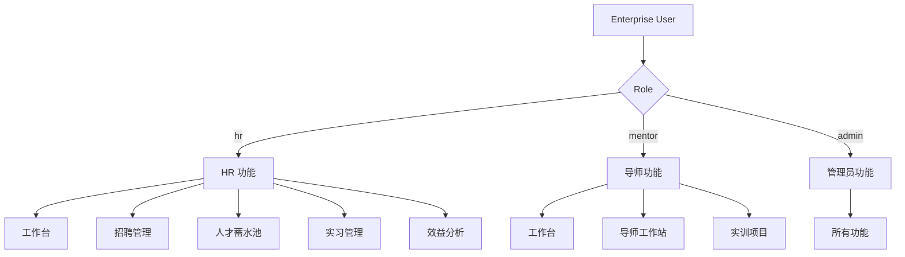
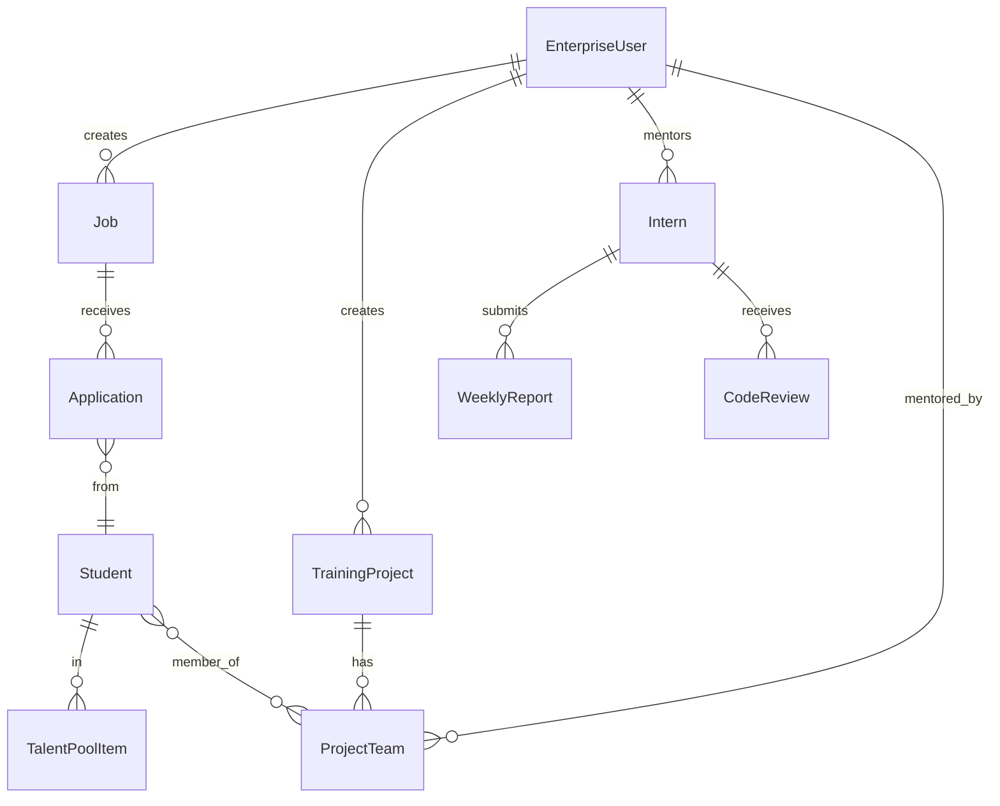
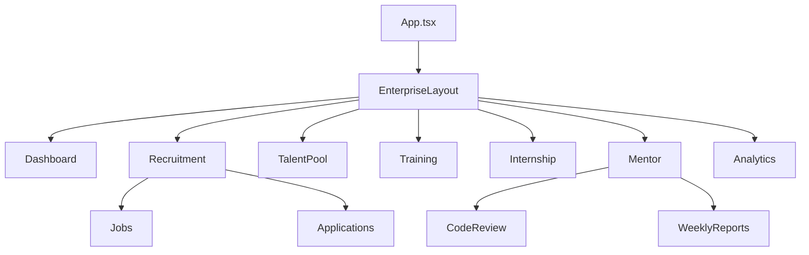
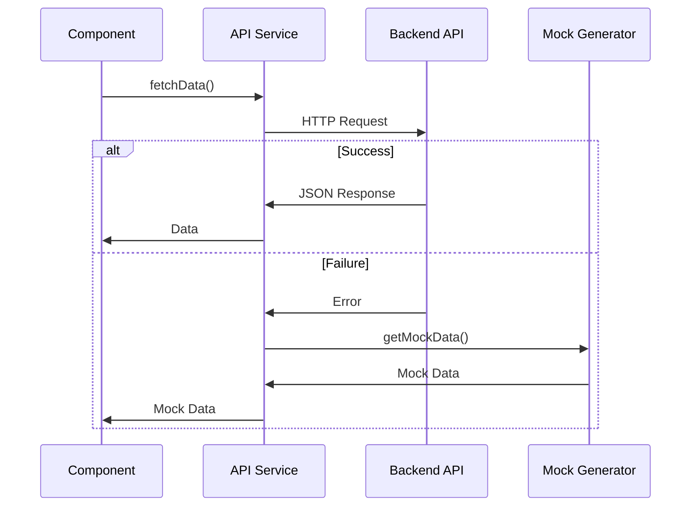
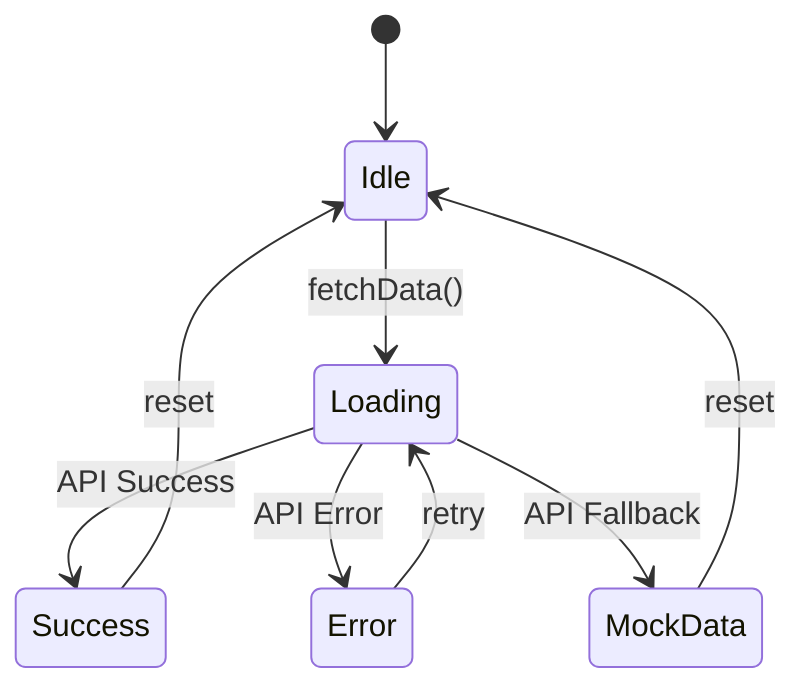

# Design Document: Enterprise Frontend Implementation

## Overview

本设计文档定义企业端前端应用的技术架构和实现方案。企业端面向 HR 人员、企业导师和企业管理员，提供人才招聘选拔、实训项目管理、实习生管理和导师工作站等核心功能。

### 技术栈

- **框架**: React 18 + TypeScript
- **构建工具**: Vite
- **UI 组件库**: shadcn/ui (基于 Radix UI)
- **样式**: Tailwind CSS
- **图表库**: recharts
- **路由**: React Router v6
- **状态管理**: React Hooks (useState, useEffect)
- **HTTP 客户端**: Fetch API

### 设计原则

1. **类型安全**: 使用 TypeScript 确保编译时类型检查
2. **渐进增强**: API 失败时自动降级到 mock 数据，保证开发体验
3. **组件复用**: 复用 shadcn/ui 组件库，保持 UI 一致
5. **角色权限**: 基于角色的导航和功能访问控制
6. **代码组织**: 参考平台端实现模式，保持项目结构一致性

## Architecture

### 目录结构

```
frontend/src/enterprise/
├── types.ts                    # TypeScript 类型定义
├── layout.tsx                  # 企业端布局组件
├── services/
│   └── api.ts                  # API 服务层
├── mock/
│   └── generator.ts            # Mock 数据生成器
├── utils/
│   └── auth.ts                 # 权限工具函数
├── dashboard/
│   └── page.tsx                # 企业人才工作台
├── recruitment/
│   ├── page.tsx                # 招聘管理主页
│   ├── jobs.tsx                # 职位管理
│   └── applications.tsx        # 简历筛选
├── talent-pool/
│   └── page.tsx                # 人才蓄水池
├── training/
│   └── page.tsx                # 实训项目管理
├── internship/
│   └── page.tsx                # 实习生管理
├── mentor/
│   ├── page.tsx                # 导师工作站主页
│   ├── code-review.tsx         # 代码评审
│   └── weekly-reports.tsx      # 周报批阅
└── analytics/
    └── page.tsx                # 企业效益分析
```

### 数据流架构

```
┌─────────────────┐
│  React Component│
└────────┬────────┘
         │ 调用
         ▼
┌─────────────────┐
│  API Service    │
│  (api.ts)       │
└────────┬────────┘
         │
         ├─ 成功 ──► Backend API
         │
         └─ 失败 ──► Mock Generator
                     (generator.ts)
```

### 角色权限模型



## Components and Interfaces

### 1. 类型定义系统 (types.ts)

#### 核心类型

```typescript
// 企业员工角色
export const EnterpriseRole = {
  HR: 'hr',
  MENTOR: 'mentor',
  ADMIN: 'admin',
} as const;

export type EnterpriseRole = typeof EnterpriseRole[keyof typeof EnterpriseRole];

// 企业用户信息
export interface EnterpriseUser {
  id: string;
  name: string;
  role: EnterpriseRole;
  enterprise_id: string;
  enterprise_name: string;
  avatar?: string;
  email?: string;
  phone?: string;
}

// 职位信息
export interface Job {
  id: string;
  title: string;
  type: 'internship' | 'full_time' | 'part_time';
  description: string;
  requirements: string[];
  salary_range: string;
  location: string;
  status: 'active' | 'closed' | 'draft';
  created_at: string;
  updated_at: string;
  applicant_count?: number;
}

// 简历申请
export interface Application {
  application_id: string;
  job_id: string;
  job_title: string;
  student_id: string;
  student_name: string;
  school: string;
  major: string;
  resume_url: string;
  match_score: number; // 0-1
  apply_time: string;
  status: 'pending' | 'interview' | 'offered' | 'rejected' | 'withdrawn';
  interview_time?: string;
  interview_type?: 'online' | 'onsite';
  interview_link?: string;
}

// 人才蓄水池
export interface TalentPoolItem {
  id: string;
  student_id: string;
  student_name: string;
  school: string;
  major: string;
  tags: string[];
  skills: string[];
  collect_time: string;
  notes?: string;
}

// 实训项目
export interface TrainingProject {
  id: string;
  name: string;
  description: string;
  difficulty: number; // 1-5
  tech_stack: string[];
  max_teams: number;
  current_teams: number;
  resources_url?: string;
  status: 'draft' | 'recruiting' | 'in_progress' | 'completed';
  start_date?: string;
  end_date?: string;
  created_at: string;
}

// 项目团队
export interface ProjectTeam {
  team_id: string;
  project_id: string;
  team_name: string;
  members: TeamMember[];
  mentor_id?: string;
  mentor_name?: string;
  progress: number; // 0-100
  status: 'active' | 'completed' | 'dropped';
}

export interface TeamMember {
  student_id: string;
  student_name: string;
  school: string;
  role: 'leader' | 'member';
}

// 实习生信息
export interface Intern {
  id: string;
  student_id: string;
  name: string;
  school: string;
  major: string;
  position: string;
  start_date: string;
  end_date?: string;
  mentor_id: string;
  mentor_name: string;
  status: 'pending' | 'active' | 'completed' | 'terminated';
  contract_status: 'pending' | 'signed' | 'rejected';
  salary?: string;
}

// 周报
export interface WeeklyReport {
  id: string;
  intern_id: string;
  intern_name: string;
  week: number;
  content: string;
  submit_time: string;
  score?: number; // 0-100
  mentor_comment?: string;
  status: 'pending' | 'reviewed';
}

// 代码评审
export interface CodeReview {
  id: string;
  project_id: string;
  project_name: string;
  student_id: string;
  student_name: string;
  file: string;
  line: number;
  code_snippet: string;
  comment: string;
  status: 'pending' | 'resolved' | 'closed';
  created_at: string;
  resolved_at?: string;
}

// 工作台统计数据
export interface DashboardStats {
  active_jobs: number;
  pending_applications: number;
  active_interns: number;
  pending_reviews: number;
  pending_weekly_reports: number;
  upcoming_interviews: number;
}

// 待办事项
export interface TodoItem {
  id: string;
  type: 'interview' | 'weekly_report' | 'code_review' | 'contract';
  title: string;
  description: string;
  due_time?: string;
  priority: 'high' | 'medium' | 'low';
}

// 活动时间线
export interface ActivityItem {
  id: string;
  type: 'application' | 'interview' | 'weekly_report' | 'review';
  title: string;
  description: string;
  time: string;
  actor?: string;
}

// 导师仪表盘数据
export interface MentorDashboard {
  pending_code_reviews: number;
  pending_weekly_reports: number;
  upcoming_interviews: number;
  students: MentorStudent[];
}

export interface MentorStudent {
  student_id: string;
  student_name: string;
  type: 'training' | 'internship';
  project_name?: string;
  position?: string;
  start_date: string;
}

// 企业效益分析数据
export interface AnalyticsData {
  conversion_rate: {
    internship_to_fulltime: number;
    cost_saving: number;
  };
  conversion_trend: {
    month: string;
    rate: number;
  }[];
  contribution: {
    total_value: number;
    by_department: { department: string; value: number }[];
  };
  recruitment_funnel: {
    stage: string;
    count: number;
  }[];
}

// 导航项
export interface NavItem {
  title: string;
  href: string;
  icon: string;
  roles: EnterpriseRole[];
  description?: string;
}
```

### 2. API 服务层 (services/api.ts)

#### fetchWithFallback 模式

```typescript
async function fetchWithFallback<T>(
  url: string,
  mockFn: () => T,
  options?: RequestInit
): Promise<T> {
  try {
    const response = await fetch(url, options);
    if (!response.ok) {
      throw new Error(`API Error: ${response.status}`);
    }
    const contentType = response.headers.get('content-type');
    if (!contentType || !contentType.includes('application/json')) {
      throw new Error('Non-JSON response');
    }
    return await response.json() as T;
  } catch (error) {
    console.warn(`API failed for ${url}, using mock data.`, error);
    await new Promise(resolve => setTimeout(resolve, 500)); // 模拟网络延迟
    return mockFn();
  }
}
```

#### API 端点配置

```typescript
const ENTERPRISE_API_BASE = import.meta.env.VITE_ENTERPRISE_API_BASE_URL || '/api/enterprise/v1';
const TRAINING_API_BASE = import.meta.env.VITE_TRAINING_API_BASE_URL || '/api/training/v1';
```

#### API 函数列表

- `fetchDashboardStats()`: 获取工作台统计数据
- `fetchJobs(params?)`: 获取职位列表（支持状态筛选）
- `createJob(data)`: 创建新职位
- `updateJob(id, data)`: 更新职位
- `closeJob(id)`: 关闭职位
- `fetchApplications(params?)`: 获取简历申请列表
- `updateApplicationStatus(id, status, data?)`: 更新申请状态
- `fetchTalentPool(params?)`: 获取人才蓄水池
- `addToTalentPool(studentId, tags)`: 添加到人才蓄水池
- `removeFromTalentPool(id)`: 从人才蓄水池移除
- `fetchTrainingProjects(params?)`: 获取实训项目列表
- `createTrainingProject(data)`: 创建实训项目
- `fetchProjectTeams(projectId)`: 获取项目团队列表
- `assignMentor(teamId, mentorId)`: 分配导师
- `fetchInterns(params?)`: 获取实习生列表
- `sendOffer(data)`: 发送 Offer
- `fetchWeeklyReports(params?)`: 获取周报列表
- `reviewWeeklyReport(id, score, comment)`: 批阅周报
- `fetchCodeReviews(params?)`: 获取代码评审列表
- `submitCodeReview(id, comment)`: 提交代码评审
- `fetchMentorDashboard()`: 获取导师仪表盘数据
- `fetchAnalytics(timeRange)`: 获取企业效益分析数据

### 3. Mock 数据生成器 (mock/generator.ts)

#### 辅助函数

```typescript
const ri = (min: number, max: number) => Math.floor(Math.random() * (max - min + 1)) + min;
const rf = (min: number, max: number, d = 3) => parseFloat((Math.random() * (max - min) + min).toFixed(d));
const pick = <T>(arr: readonly T[]): T => arr[Math.floor(Math.random() * arr.length)];
const uid = () => Math.random().toString(36).slice(2, 10);
const pastIso = (daysAgo: number) => new Date(Date.now() - daysAgo * 86400_000).toISOString();
const futureIso = (daysAhead: number) => new Date(Date.now() + daysAhead * 86400_000).toISOString();
```

#### Mock 数据函数

每个 mock 函数生成符合真实业务场景的数据：

- `getMockDashboardStats()`: 生成工作台统计（5-20 个在招职位，10-50 个待处理简历等）
- `getMockJobs()`: 生成 5-10 个职位（包含前端、后端、测试等岗位）
- `getMockApplications()`: 生成 10-20 个简历申请（匹配度 0.3-0.95）
- `getMockTalentPool()`: 生成 8-15 个人才池学生（带技能标签）
- `getMockTrainingProjects()`: 生成 4-8 个实训项目（不同难度和技术栈）
- `getMockProjectTeams()`: 生成项目团队（3-5 人团队，进度 0-100%）
- `getMockInterns()`: 生成 6-12 个实习生（不同状态和导师）
- `getMockWeeklyReports()`: 生成 8-15 个周报（部分已批阅，部分待批阅）
- `getMockCodeReviews()`: 生成 5-10 个代码评审（不同文件和状态）
- `getMockMentorDashboard()`: 生成导师仪表盘数据
- `getMockAnalytics()`: 生成企业效益分析数据（包含图表数据）

### 4. 布局组件 (layout.tsx)

#### 组件结构

```typescript
const EnterpriseLayout = () => {
  const currentUser = getMockCurrentUser();
  const navItems = filterNavItemsByRole(allNavItems, currentUser.role);
  
  return (
    <div className="flex h-screen">
      <aside className="w-16 lg:w-64 border-r">
        {/* 品牌标识 */}
        {/* 导航菜单 */}
        {/* 用户信息 */}
      </aside>
      <main className="flex-1 overflow-auto">
        <Outlet />
      </main>
    </div>
  );
};
```

#### 导航配置

```typescript
const allNavItems: NavItem[] = [
  { title: '工作台', href: '/enterprise/dashboard', icon: 'LayoutDashboard', roles: ['hr', 'mentor', 'admin'] },
  { title: '招聘管理', href: '/enterprise/recruitment', icon: 'Users', roles: ['hr', 'admin'] },
  { title: '人才蓄水池', href: '/enterprise/talent-pool', icon: 'Database', roles: ['hr', 'admin'] },
  { title: '实训项目', href: '/enterprise/training', icon: 'Layers', roles: ['mentor', 'admin'] },
  { title: '实习管理', href: '/enterprise/internship', icon: 'Briefcase', roles: ['hr', 'admin'] },
  { title: '导师工作站', href: '/enterprise/mentor', icon: 'GraduationCap', roles: ['mentor', 'admin'] },
  { title: '效益分析', href: '/enterprise/analytics', icon: 'TrendingUp', roles: ['hr', 'admin'] },
];
```

#### 响应式设计

- 屏幕宽度 < 768px: 仅显示图标
- 屏幕宽度 >= 768px: 显示图标和文字
- 屏幕宽度 >= 1024px: 完整侧边栏（宽度 256px）

### 5. 权限工具 (utils/auth.ts)

```typescript
export const filterNavItemsByRole = (items: NavItem[], role: EnterpriseRole): NavItem[] => {
  return items.filter(item => item.roles.includes(role));
};

export const hasRole = (userRole: EnterpriseRole, requiredRole: EnterpriseRole): boolean => {
  if (userRole === EnterpriseRole.ADMIN) return true;
  return userRole === requiredRole;
};

export const getMockCurrentUser = (): EnterpriseUser => ({
  id: 'ent_user_001',
  name: '张经理',
  role: EnterpriseRole.HR,
  enterprise_id: 'ent_001',
  enterprise_name: '字节跳动科技有限公司',
  avatar: undefined,
});
```

### 6. 页面组件设计

#### 6.1 企业人才工作台 (dashboard/page.tsx)

**组件结构**:
- 统计卡片区域（4 个卡片：在招职位、待处理简历、在岗实习生、待评审任务）
- 待办事项列表（使用 Tabs 组件分类：待面试、待批阅周报、待代码评审）
- 最近活动时间线
- 快捷操作按钮
- 趋势图表（使用 recharts 的 LineChart）

**数据加载**:
```typescript
const [stats, setStats] = useState<DashboardStats | null>(null);
const [todos, setTodos] = useState<TodoItem[]>([]);
const [activities, setActivities] = useState<ActivityItem[]>([]);

useEffect(() => {
  fetchDashboardStats().then(setStats);
  // ... 加载其他数据
}, []);
```

#### 6.2 招聘管理 (recruitment/page.tsx)

**子组件**:
- `jobs.tsx`: 职位管理（Table 组件展示，Dialog 组件创建/编辑）
- `applications.tsx`: 简历筛选（Table 组件展示，Progress 组件显示匹配度）

**关键功能**:
- 职位筛选（Select 组件）
- 发布新职位（Dialog + Form）
- 查看简历详情（打开新标签页）
- 发起面试邀约（Dialog + DatePicker）
- 加入人才蓄水池（Dialog + 标签选择）
- 批量操作（Checkbox + 批量按钮）

#### 6.3 人才蓄水池 (talent-pool/page.tsx)

**组件结构**:
- 筛选区域（按标签筛选）
- 学生卡片列表（Card 组件，显示头像、姓名、学校、标签）
- 技能雷达图（recharts 的 RadarChart）
- 操作按钮（查看详情、发送邀约、移除）

#### 6.4 实训项目管理 (training/page.tsx)

**组件结构**:
- 项目列表（Card 组件，显示名称、难度星级、技术栈 Badge、参与团队数）
- 发布新项目（Dialog + Form）
- 团队列表（展开查看，Table 组件）
- 分配导师（Select 组件）

#### 6.5 实习生管理 (internship/page.tsx)

**组件结构**:
- 实习生列表（Table 组件，显示姓名、学校、岗位、导师、状态）
- 状态筛选（Tabs 组件：在岗、已离职）
- 发送 Offer（Dialog + Form，包含薪资、开始日期、合同模板选择）
- 考勤审批（Dialog + 异常记录列表）
- 周报查看（Dialog + 周报列表）
- 发放实习证明（Dialog + 评价表单）

#### 6.6 导师工作站 (mentor/page.tsx)

**子组件**:
- `code-review.tsx`: 代码评审（Table 组件展示，Dialog 组件查看代码和添加评论）
- `weekly-reports.tsx`: 周报批阅（Table 组件展示，Dialog 组件查看内容和打分）

**组件结构**:
- 导师仪表盘（统计卡片）
- 指导学生列表（Card 组件）
- 待评审任务列表（Tabs 组件：代码评审、周报批阅）
- 历史评审记录

#### 6.7 企业效益分析 (analytics/page.tsx)

**组件结构**:
- 时间范围选择器（Select 组件：本月、本季度、本年度）
- 转化率统计卡片
- 转化率趋势图（recharts 的 LineChart）
- 贡献度分布图（recharts 的 PieChart 或 BarChart）
- 招聘漏斗图（recharts 的 FunnelChart 或自定义）
- 证书验证功能（Input + Button，显示验证结果）

## Data Models

### 数据关系



### 状态机

#### 简历申请状态流转

```
pending → interview → offered → (accepted/rejected)
pending → rejected
```

#### 实习生状态流转

```
pending → active → completed
pending → active → terminated
```

#### 周报状态流转

```
pending → reviewed
```

#### 代码评审状态流转

```
pending → resolved → closed
pending → closed
```


## Correctness Properties

*A property is a characteristic or behavior that should hold true across all valid executions of a system—essentially, a formal statement about what the system should do. Properties serve as the bridge between human-readable specifications and machine-verifiable correctness guarantees.*

### Property Reflection

After analyzing all acceptance criteria, I identified the following redundancies:

- **Criteria 2.1 and 2.2** both test API fallback behavior - they can be combined into one property
- **Criteria 5.4, 5.6, and 5.7** all test role-based filtering - 5.6 and 5.7 are specific examples covered by the general property 5.4
- **Criteria 4.5, 4.6, and 4.7** all test responsive behavior - 4.6 and 4.7 are specific examples of the general responsive property

The following properties represent the unique, testable behaviors of the system:

### Property 1: API Fallback Resilience

*For any* API endpoint that fails (network error, non-2xx status, or non-JSON response), the fetchWithFallback function should return valid mock data instead of throwing an error.

**Validates: Requirements 2.1, 2.2, 2.3**

### Property 2: API Function Return Types

*For any* API service function (fetchDashboardStats, fetchJobs, fetchApplications, etc.), calling the function should return data that matches the expected TypeScript interface structure.

**Validates: Requirements 2.4, 2.5, 2.6, 2.7, 2.8, 2.9, 2.10, 2.11, 2.12, 2.13**

### Property 3: Mock Data Structure Validity

*For any* mock generator function, the returned data should conform to the corresponding TypeScript interface and contain realistic values (e.g., dates in valid ISO format, scores in valid ranges, non-empty required fields).

**Validates: Requirements 3.1, 3.2, 3.3, 3.4, 3.5, 3.6, 3.7, 3.8, 3.9, 3.10, 3.11**

### Property 4: Role-Based Navigation Filtering

*For any* user role and navigation items list, the filterNavItemsByRole function should return only navigation items that include the user's role in their roles array, and admin role should always see all items.

**Validates: Requirements 5.4, 5.6, 5.7**

### Property 5: Layout Responsive Behavior

*For any* viewport width, the layout component should display the appropriate navigation style: icon-only for width < 768px, icon with text for width >= 768px, and full sidebar for width >= 1024px.

**Validates: Requirements 4.5, 4.6, 4.7**

### Property 6: Active Navigation Highlighting

*For any* active route, the corresponding navigation item in the sidebar should have the active styling class applied.

**Validates: Requirements 4.8**

### Property 7: Role Badge Color Mapping

*For any* enterprise user role (hr, mentor, admin), the role badge should display the correct color: blue for hr, green for mentor, red for admin.

**Validates: Requirements 4.10**

### Property 8: Job Status Filtering

*For any* job status filter value (active, closed, draft), the displayed job list should contain only jobs with that status.

**Validates: Requirements 7.2**

### Property 9: Application Filtering

*For any* combination of job filter and status filter, the displayed application list should contain only applications that match both filter criteria.

**Validates: Requirements 7.6**

### Property 10: Match Score Range Validation

*For any* application displayed in the resume screening interface, the match_score value should be a number between 0 and 1 (inclusive).

**Validates: Requirements 7.7**

### Property 11: Talent Pool Tag Filtering

*For any* tag filter applied to the talent pool, the displayed students should only include those whose tags array contains the selected tag.

**Validates: Requirements 8.2**

### Property 12: Intern Status Filtering

*For any* intern status filter (active, completed, terminated), the displayed intern list should contain only interns with that status.

**Validates: Requirements 10.2**

### Property 13: Loading State Display

*For any* component in a loading state, a loading indicator (Skeleton or Spinner) should be visible in the UI.

**Validates: Requirements 16.1**

### Property 14: Error State Display

*For any* component in an error state, an error message and retry button should be visible in the UI.

**Validates: Requirements 16.2**

### Property 15: Empty State Display

*For any* component with empty data (zero items), an empty state message and guidance should be visible in the UI.

**Validates: Requirements 16.3**

### Property 16: Form Submission Button Disabling

*For any* form during API submission, the submit button should be disabled until the API call completes (success or failure).

**Validates: Requirements 16.4**

### Property 17: Mock Data Console Logging

*For any* API call that falls back to mock data, a console warning message should be logged indicating the fallback occurred.

**Validates: Requirements 16.5**

## Error Handling

### API Error Handling Strategy

1. **Network Errors**: Catch fetch exceptions and fall back to mock data
2. **HTTP Errors**: Check response.ok and fall back on non-2xx status codes
3. **Parse Errors**: Validate Content-Type header and fall back on non-JSON responses
4. **Timeout Handling**: Consider implementing timeout for API calls (future enhancement)

### User-Facing Error Messages

```typescript
const ERROR_MESSAGES = {
  NETWORK_ERROR: '网络连接失败，请检查您的网络设置',
  SERVER_ERROR: '服务器暂时不可用，请稍后重试',
  PERMISSION_DENIED: '您没有权限执行此操作',
  VALIDATION_ERROR: '请检查输入信息是否正确',
  NOT_FOUND: '请求的资源不存在',
};
```

### Error Boundary

Implement React Error Boundary to catch component errors:

```typescript
class ErrorBoundary extends React.Component {
  componentDidCatch(error, errorInfo) {
    console.error('Component error:', error, errorInfo);
    // Log to error tracking service
  }
  
  render() {
    if (this.state.hasError) {
      return <ErrorFallback onReset={() => this.setState({ hasError: false })} />;
    }
    return this.props.children;
  }
}
```

### Form Validation

Use client-side validation before API calls:

```typescript
const validateJobForm = (data: Partial<Job>): string[] => {
  const errors: string[] = [];
  if (!data.title?.trim()) errors.push('职位标题不能为空');
  if (!data.description?.trim()) errors.push('职位描述不能为空');
  if (!data.salary_range?.trim()) errors.push('薪资范围不能为空');
  return errors;
};
```

## Testing Strategy

### Dual Testing Approach

The enterprise frontend implementation requires both unit tests and property-based tests to ensure comprehensive coverage:

- **Unit Tests**: Verify specific examples, edge cases, and error conditions
- **Property Tests**: Verify universal properties across all inputs

Both testing approaches are complementary and necessary. Unit tests catch concrete bugs in specific scenarios, while property tests verify general correctness across a wide range of inputs.

### Property-Based Testing Configuration

**Library Selection**: Use `fast-check` for TypeScript/JavaScript property-based testing

**Configuration**:
- Minimum 100 iterations per property test (due to randomization)
- Each property test must reference its design document property
- Tag format: `Feature: enterprise-frontend-implementation, Property {number}: {property_text}`

**Example Property Test**:

```typescript
import fc from 'fast-check';
import { filterNavItemsByRole } from './utils/auth';
import { EnterpriseRole } from './types';

describe('Property 4: Role-Based Navigation Filtering', () => {
  it('should only return nav items that include the user role', () => {
    // Feature: enterprise-frontend-implementation, Property 4: Role-Based Navigation Filtering
    fc.assert(
      fc.property(
        fc.constantFrom(EnterpriseRole.HR, EnterpriseRole.MENTOR, EnterpriseRole.ADMIN),
        fc.array(fc.record({
          title: fc.string(),
          href: fc.string(),
          icon: fc.string(),
          roles: fc.array(fc.constantFrom(EnterpriseRole.HR, EnterpriseRole.MENTOR, EnterpriseRole.ADMIN)),
        })),
        (role, navItems) => {
          const filtered = filterNavItemsByRole(navItems, role);
          
          // All returned items should include the user's role
          const allIncludeRole = filtered.every(item => item.roles.includes(role));
          
          // Admin should see all items
          if (role === EnterpriseRole.ADMIN) {
            return filtered.length === navItems.length && allIncludeRole;
          }
          
          return allIncludeRole;
        }
      ),
      { numRuns: 100 }
    );
  });
});
```

### Unit Testing Strategy

**Focus Areas**:
1. **Component Rendering**: Test that components render without crashing
2. **User Interactions**: Test button clicks, form submissions, filter changes
3. **Edge Cases**: Empty data, invalid inputs, boundary values
4. **Integration Points**: Component communication, route navigation

**Example Unit Test**:

```typescript
import { render, screen, fireEvent } from '@testing-library/react';
import { JobManagement } from './recruitment/jobs';

describe('JobManagement Component', () => {
  it('should display empty state when no jobs exist', () => {
    render(<JobManagement jobs={[]} />);
    expect(screen.getByText(/暂无职位/i)).toBeInTheDocument();
  });
  
  it('should filter jobs by status', () => {
    const jobs = [
      { id: '1', title: 'Job 1', status: 'active' },
      { id: '2', title: 'Job 2', status: 'closed' },
    ];
    render(<JobManagement jobs={jobs} />);
    
    fireEvent.change(screen.getByLabelText(/状态/i), { target: { value: 'active' } });
    
    expect(screen.getByText('Job 1')).toBeInTheDocument();
    expect(screen.queryByText('Job 2')).not.toBeInTheDocument();
  });
});
```

### Testing Tools

- **Test Runner**: Vitest (fast, Vite-native)
- **React Testing**: @testing-library/react
- **Property Testing**: fast-check
- **Mocking**: vi.mock() from Vitest
- **Coverage**: Vitest coverage (c8)

### Coverage Goals

- **Unit Test Coverage**: Minimum 70% line coverage
- **Property Test Coverage**: All 17 correctness properties must have corresponding tests
- **Critical Paths**: 100% coverage for authentication, API fallback, and role filtering

### Test Organization

```
frontend/src/enterprise/
├── __tests__/
│   ├── unit/
│   │   ├── components/
│   │   │   ├── layout.test.tsx
│   │   │   ├── dashboard.test.tsx
│   │   │   └── ...
│   │   ├── services/
│   │   │   └── api.test.ts
│   │   └── utils/
│   │       └── auth.test.ts
│   └── properties/
│       ├── api-fallback.property.test.ts
│       ├── role-filtering.property.test.ts
│       ├── data-filtering.property.test.ts
│       └── ...
```

### Continuous Integration

- Run all tests on every pull request
- Fail build if coverage drops below threshold
- Run property tests with increased iterations (500+) in CI
- Generate and publish coverage reports


## Implementation Details

### Phase 1: 基础架构搭建

**优先级**: P0 (必须)

1. **创建类型定义** (types.ts)
   - 定义所有接口和枚举
   - 确保类型完整性和一致性
   - 导出所有类型供其他模块使用

2. **实现 Mock 数据生成器** (mock/generator.ts)
   - 实现所有 mock 函数
   - 确保数据符合真实业务场景
   - 使用辅助函数生成随机但合理的数据

3. **实现 API 服务层** (services/api.ts)
   - 实现 fetchWithFallback 核心函数
   - 实现所有 API 调用函数
   - 配置 API 基础 URL
   - 添加错误处理和日志

4. **实现权限工具** (utils/auth.ts)
   - 实现角色过滤函数
   - 实现 getMockCurrentUser 函数
   - 添加权限检查辅助函数

5. **创建布局组件** (layout.tsx)
   - 实现响应式侧边栏
   - 实现导航菜单
   - 实现用户信息展示
   - 集成角色权限过滤

6. **配置路由** (App.tsx)
   - 添加企业端路由组
   - 配置所有子路由
   - 设置默认重定向

### Phase 2: 核心功能实现

**优先级**: P0 (必须)

1. **企业人才工作台** (dashboard/page.tsx)
   - 实现统计卡片
   - 实现待办事项列表
   - 实现活动时间线
   - 集成 recharts 图表

2. **招聘管理模块** (recruitment/)
   - 实现职位管理 (jobs.tsx)
   - 实现简历筛选 (applications.tsx)
   - 实现筛选和搜索功能
   - 实现批量操作

3. **实习生管理模块** (internship/page.tsx)
   - 实现实习生列表
   - 实现 Offer 发送功能
   - 实现考勤审批
   - 实现证明发放

### Phase 3: 高级功能实现

**优先级**: P1 (重要)

1. **人才蓄水池模块** (talent-pool/page.tsx)
   - 实现学生列表
   - 实现标签筛选
   - 实现技能雷达图
   - 实现邀约功能

2. **实训项目管理** (training/page.tsx)
   - 实现项目列表
   - 实现项目发布
   - 实现团队管理
   - 实现导师分配

3. **导师工作站** (mentor/)
   - 实现导师仪表盘 (page.tsx)
   - 实现代码评审 (code-review.tsx)
   - 实现周报批阅 (weekly-reports.tsx)
   - 实现学生管理

4. **企业效益分析** (analytics/page.tsx)
   - 实现统计数据展示
   - 实现多种图表（折线图、饼图、漏斗图）
   - 实现证书验证功能
   - 实现时间范围选择

### Phase 4: 优化和完善

**优先级**: P2 (可选)

1. **性能优化**
   - 实现虚拟滚动（长列表）
   - 实现懒加载（图片、组件）
   - 优化 re-render（React.memo, useMemo）
   - 实现请求去重和缓存

2. **用户体验优化**
   - 添加骨架屏加载
   - 添加过渡动画
   - 优化移动端体验
   - 添加键盘快捷键

3. **可访问性**
   - 添加 ARIA 标签
   - 确保键盘导航
   - 优化屏幕阅读器支持
   - 确保颜色对比度

4. **国际化准备**
   - 提取所有文本到常量
   - 准备 i18n 配置
   - 支持日期格式化

### 技术债务和注意事项

1. **Mock 数据切换**
   - 当前使用 getMockCurrentUser 返回固定用户
   - 生产环境需要从认证系统获取真实用户信息
   - 需要实现 token 管理和刷新机制

2. **API 端点配置**
   - 当前使用环境变量配置 API 基础 URL
   - 需要为不同环境（开发、测试、生产）配置不同的 URL
   - 考虑使用 API 网关统一入口

3. **状态管理**
   - 当前使用 React Hooks 本地状态
   - 如果状态共享需求增加，考虑引入 Zustand 或 Jotai
   - 避免过度使用全局状态

4. **类型安全**
   - 确保所有 API 响应都有对应的类型定义
   - 使用 TypeScript strict 模式
   - 定期检查类型覆盖率

### 开发规范

1. **命名约定**
   - 组件文件使用 PascalCase: `DashboardPage.tsx`
   - 工具函数文件使用 kebab-case: `auth-utils.ts`
   - 常量使用 UPPER_SNAKE_CASE: `API_BASE_URL`

2. **代码组织**
   - 每个页面组件不超过 300 行
   - 复杂逻辑提取为自定义 Hook
   - 可复用组件放入 components/ 目录

3. **注释规范**
   - 复杂逻辑添加注释说明
   - 公共函数添加 JSDoc 注释
   - TODO 注释包含负责人和日期

4. **Git 提交规范**
   - feat: 新功能
   - fix: 修复 bug
   - refactor: 重构
   - style: 样式调整
   - test: 测试相关
   - docs: 文档更新

### 依赖管理

**核心依赖**:
```json
{
  "react": "^18.2.0",
  "react-dom": "^18.2.0",
  "react-router-dom": "^6.20.0",
  "typescript": "^5.3.0"
}
```

**UI 依赖**:
```json
{
  "@radix-ui/react-*": "latest",
  "tailwindcss": "^3.4.0",
  "lucide-react": "^0.300.0",
  "recharts": "^2.10.0"
}
```

**开发依赖**:
```json
{
  "vite": "^5.0.0",
  "vitest": "^1.0.0",
  "@testing-library/react": "^14.1.0",
  "fast-check": "^3.15.0"
}
```

### 环境变量配置

**.env.development**:
```
VITE_ENTERPRISE_API_BASE_URL=http://localhost:8080/api/enterprise/v1
VITE_TRAINING_API_BASE_URL=http://localhost:8080/api/training/v1
```

**.env.production**:
```
VITE_ENTERPRISE_API_BASE_URL=https://api.zhitu.com/enterprise/v1
VITE_TRAINING_API_BASE_URL=https://api.zhitu.com/training/v1
```

## Diagrams

### Component Hierarchy



### Data Flow



### State Management



## Security Considerations

### 1. 认证和授权

- 所有 API 请求必须携带有效的 JWT token
- Token 存储在 httpOnly cookie 中（防止 XSS）
- 实现 token 自动刷新机制
- 前端验证用户角色，后端强制执行权限

### 2. 数据验证

- 所有用户输入必须进行客户端验证
- 使用 TypeScript 类型系统防止类型错误
- 对敏感数据（如薪资、联系方式）进行脱敏显示
- 防止 XSS 攻击：使用 React 的自动转义

### 3. API 安全

- 使用 HTTPS 加密传输
- 实现 CSRF 保护
- 限制 API 请求频率（防止暴力攻击）
- 敏感操作需要二次确认

### 4. 隐私保护

- 遵守 GDPR 和中国个人信息保护法
- 学生简历和个人信息加密存储
- 实现数据访问日志
- 提供数据导出和删除功能

## Performance Optimization

### 1. 代码分割

```typescript
// 路由级别的代码分割
const Dashboard = lazy(() => import('./dashboard/page'));
const Recruitment = lazy(() => import('./recruitment/page'));
const Mentor = lazy(() => import('./mentor/page'));
```

### 2. 图片优化

- 使用 WebP 格式
- 实现懒加载
- 使用 CDN 加速
- 压缩图片大小

### 3. 缓存策略

```typescript
// API 响应缓存
const cache = new Map<string, { data: any; timestamp: number }>();

const fetchWithCache = async (url: string, ttl = 60000) => {
  const cached = cache.get(url);
  if (cached && Date.now() - cached.timestamp < ttl) {
    return cached.data;
  }
  const data = await fetch(url).then(r => r.json());
  cache.set(url, { data, timestamp: Date.now() });
  return data;
};
```

### 4. 渲染优化

- 使用 React.memo 避免不必要的 re-render
- 使用 useMemo 和 useCallback 缓存计算结果
- 虚拟滚动处理长列表
- 防抖和节流处理频繁操作

## Deployment

### 构建配置

```bash
# 开发环境
npm run dev

# 生产构建
npm run build

# 预览生产构建
npm run preview
```

### 部署流程

1. **代码审查**: 所有代码必须经过 PR 审查
2. **自动化测试**: CI 运行所有测试
3. **构建**: 生成生产优化的静态文件
4. **部署**: 上传到 CDN 或静态托管服务
5. **验证**: 冒烟测试验证核心功能

### 监控和日志

- 使用 Sentry 或类似服务监控前端错误
- 实现用户行为分析（Google Analytics 或自建）
- 记录 API 调用性能指标
- 设置告警规则

## Maintenance and Support

### 版本管理

- 使用语义化版本号 (Semantic Versioning)
- 主版本号：不兼容的 API 变更
- 次版本号：向后兼容的功能新增
- 修订号：向后兼容的问题修正

### 文档维护

- 保持 README.md 更新
- 记录重要的架构决策 (ADR)
- 维护 API 文档
- 更新用户手册

### 技术升级

- 定期更新依赖包（每季度）
- 关注安全漏洞通知
- 评估新技术的引入
- 保持与平台端技术栈一致

## Summary

本设计文档定义了企业端前端的完整技术架构，包括：

1. **类型系统**: 完整的 TypeScript 类型定义，确保类型安全
2. **API 服务**: fetchWithFallback 模式，支持自动降级到 mock 数据
3. **Mock 数据**: 真实场景的 mock 数据生成器，支持离线开发
4. **布局组件**: 响应式侧边栏布局，支持角色权限过滤
5. **功能模块**: 7 个核心功能模块，覆盖招聘、实训、实习、导师等场景
6. **测试策略**: 双重测试方法（单元测试 + 属性测试），确保代码质量
7. **性能优化**: 代码分割、缓存、懒加载等优化策略
8. **安全考虑**: 认证授权、数据验证、隐私保护等安全措施

该设计遵循 React 18 + TypeScript + Vite + shadcn/ui 技术栈，参考平台端实现模式，保持项目结构一致性。通过渐进增强的设计理念，确保在 API 不可用时仍能正常开发和演示。

