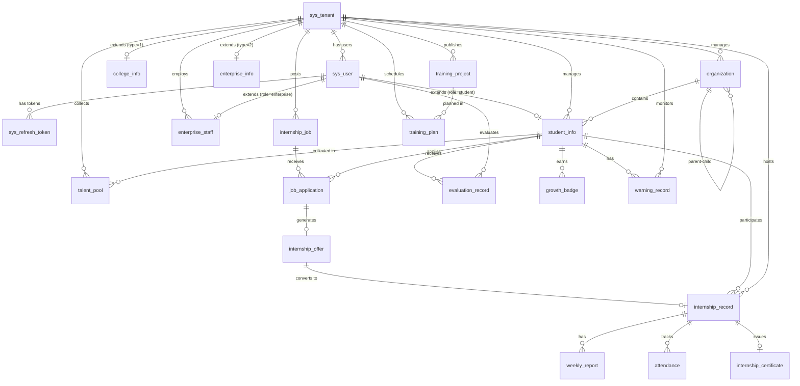
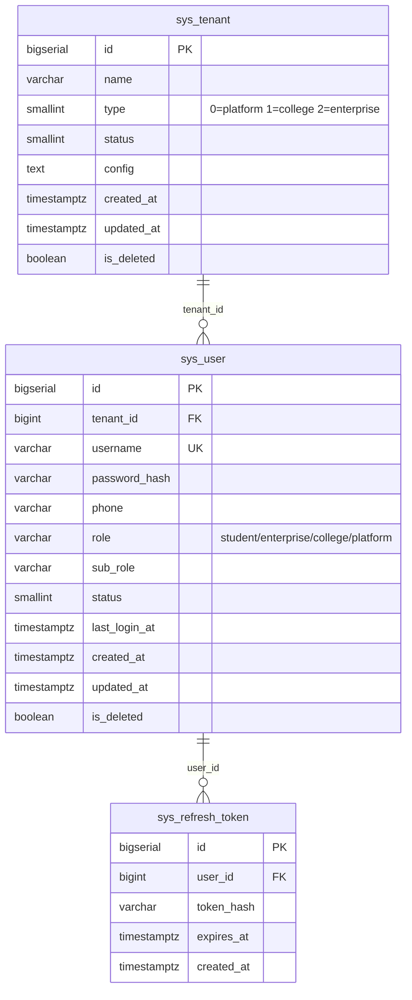
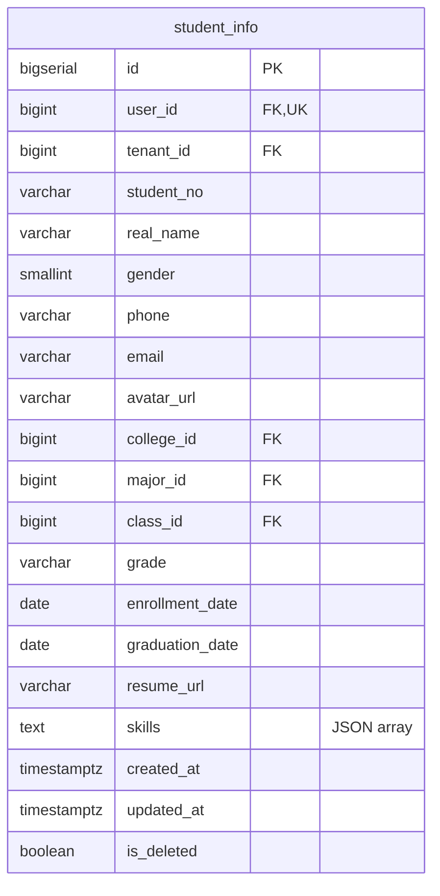
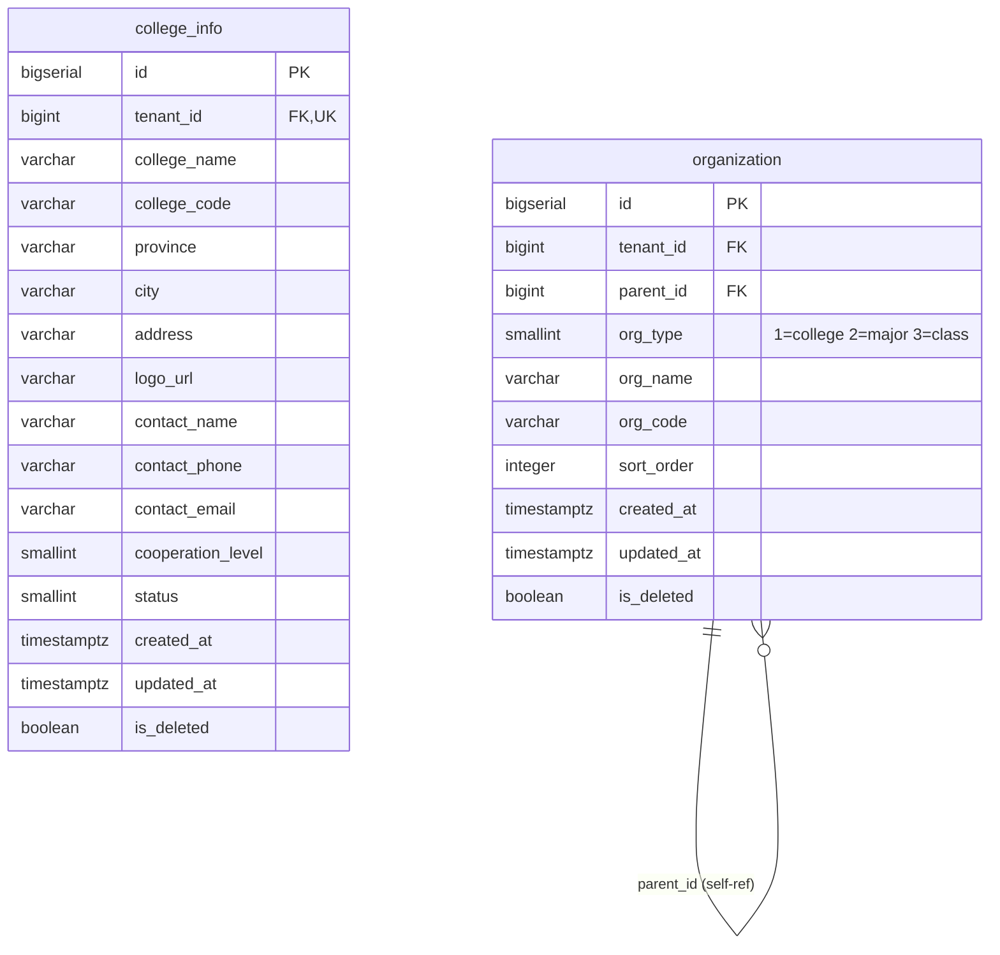
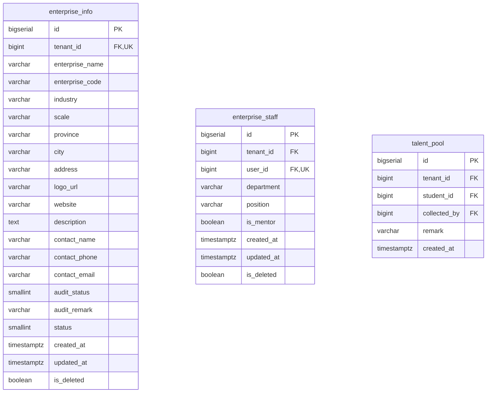
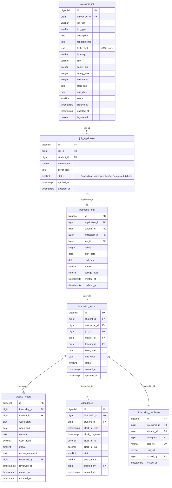
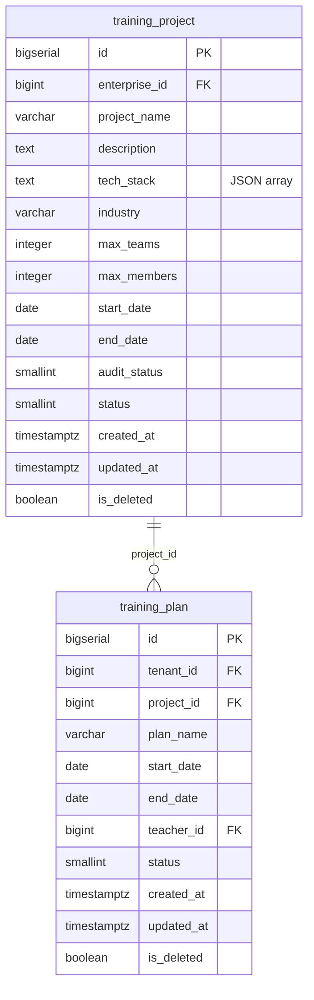
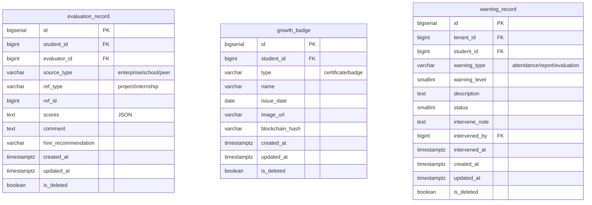

# Entity Relationship Diagram

Complete ER diagram for the Zhitu Internship Management Platform.

## Core Relationships Overview



## Detailed Schema Relationships

### 1. Authentication & Tenant Management (auth_center)



### 2. Student Service (student_svc)



### 3. College Service (college_svc)



### 4. Enterprise Service (enterprise_svc)



### 5. Internship Service (internship_svc)



### 6. Training Service (training_svc)



### 7. Growth Service (growth_svc)



## Key Relationships Explained

### User Role Extensions
- `sys_user.role = 'student'` → extends to `student_info` (1:1 via user_id)
- `sys_user.role = 'enterprise'` → extends to `enterprise_staff` (1:1 via user_id)
- `sys_user.role = 'college'` → no extension table (uses sub_role for permissions)
- `sys_user.role = 'platform'` → no extension table (platform admin)

### Tenant Type Extensions
- `sys_tenant.type = 1` (college) → extends to `college_info` (1:1 via tenant_id)
- `sys_tenant.type = 2` (enterprise) → extends to `enterprise_info` (1:1 via tenant_id)
- `sys_tenant.type = 0` (platform) → no extension table

### Internship Lifecycle
1. Enterprise posts `internship_job`
2. Student submits `job_application`
3. Enterprise sends `internship_offer`
4. Student accepts → creates `internship_record`
5. During internship: `weekly_report` + `attendance`
6. After completion: `internship_certificate`

### Organization Hierarchy
```
college_info (tenant)
  └─ organization (type=1, college/school)
      └─ organization (type=2, major)
          └─ organization (type=3, class)
              └─ student_info (class_id)
```

### Evaluation Sources
- `source_type = 'enterprise'` → Enterprise mentor evaluation
- `source_type = 'school'` → College teacher evaluation
- `source_type = 'peer'` → Student peer evaluation

## Cardinality Summary

| Relationship | Type | Description |
|--------------|------|-------------|
| tenant → users | 1:N | One tenant has many users |
| user → refresh_tokens | 1:N | One user has many tokens |
| user → student_info | 1:1 | One-to-one extension |
| user → enterprise_staff | 1:1 | One-to-one extension |
| tenant → college_info | 1:1 | One-to-one extension |
| tenant → enterprise_info | 1:1 | One-to-one extension |
| organization → children | 1:N | Self-referencing hierarchy |
| enterprise → jobs | 1:N | One enterprise posts many jobs |
| job → applications | 1:N | One job receives many applications |
| application → offer | 1:1 | One application generates one offer |
| student → internships | 1:N | One student has many internships |
| internship → reports | 1:N | One internship has many weekly reports |
| internship → attendance | 1:N | One internship has many attendance records |
| student → evaluations | 1:N | One student receives many evaluations |
| student → badges | 1:N | One student earns many badges |

## Index Strategy

### Primary Indexes
- All `id` columns (BIGSERIAL PRIMARY KEY)
- All foreign key columns
- Unique constraints (username, cert_no, etc.)

### Performance Indexes
- Tenant-based queries: `tenant_id` with partial index `WHERE is_deleted = FALSE`
- Status-based queries: `status` columns with partial indexes
- Date range queries: `start_date`, `end_date`, `created_at`
- Location queries: `city`, `province`
- Type/category queries: `role`, `type`, `source_type`

### Composite Indexes
- `(job_id, student_id)` for application uniqueness
- `(tenant_id, student_id)` for talent pool uniqueness
- `(ref_type, ref_id)` for evaluation lookups
- `(week_start, week_end)` for report queries
